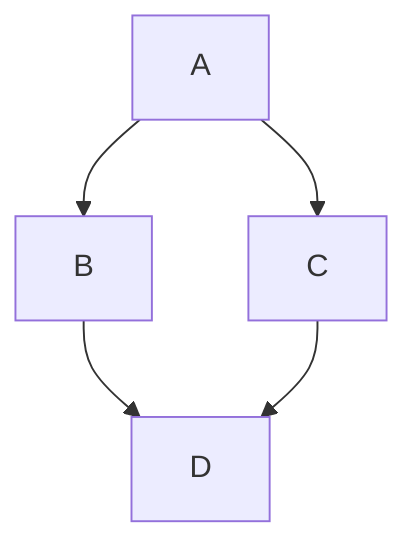

# Nano's 技术博客

基于 [Hexo](https://hexo.io/) + [NexT](https://theme-next.js.org/) 主题的个人技术博客，通过 **GitHub Actions** 自动构建并部署到 GitHub Pages。

- 🌐 在线地址：https://nanoyeluo.github.io
- ⚙️ 框架：Hexo 8 + NexT 8
- 🚀 部署：GitHub Actions（push 到 `main` 分支自动发布）

---

## 一、环境准备

首次使用需要安装以下环境（之后可跳过）：

| 软件 | 版本要求 | 下载地址 |
|------|---------|---------|
| Node.js | v22.x | https://nodejs.org |
| Git | 最新版 | https://git-scm.com |

安装后克隆本仓库并安装依赖：

```bash
git clone https://github.com/Nanoyeluo/nanoyeluo.github.io.git
cd nanoyeluo.github.io
npm install
```

---

## 二、本地预览

```bash
hexo server
```

启动后访问 http://localhost:4000 即可实时预览博客（支持热更新，修改文章保存后立即生效）。

其他常用本地命令：

```bash
hexo clean      # 清除缓存和已生成的静态文件
hexo generate   # 生成静态文件到 public/ 目录（简写 hexo g）
```

---

## 三、如何写博客

### 1. 创建新文章

```bash
hexo new "我的文章标题"
```

执行后会在 `source/_posts/` 下生成 `我的文章标题.md` 文件。

> 新建页面（如关于我）：`hexo new page "about"`，会生成 `source/about/index.md`

### 2. 编辑文章

打开生成的 Markdown 文件，顶部自带 Front-matter（文章元信息）：

```markdown
---
title: 我的文章标题        # 文章标题
date: 2026-09-11 10:00:00  # 发布时间
tags:                      # 标签（可选）
  - 前端
  - JavaScript
categories:                # 分类（可选）
  - 技术笔记
description: 文章摘要       # 摘要（可选，用于 SEO）
---

这里是正文，支持 Markdown 语法……
```

常用 Front-matter 字段：

| 字段 | 说明 |
|------|------|
| `title` | 文章标题 |
| `date` | 发布时间，可手动修改为过去时间做归档 |
| `updated` | 更新时间（默认取文件修改时间） |
| `tags` | 标签，多个标签用列表 `-` 列出 |
| `categories` | 分类，多个分类会构成层级 |
| `description` | 文章摘要，用于 SEO 和分享卡片 |
| `comments` | 设为 `false` 可关闭该文章评论 |

### 3. Markdown 语法速查

```markdown
# 一级标题  ## 二级标题  ### 三级标题

**加粗**  *斜体*  ~~删除线~~  `行内代码`

[链接文字](https://example.com)


 


- 无序列表项 1
- 无序列表项 2

1. 有序列表项 1
2. 有序列表项 2

> 引用文字

```代码块（支持语法高亮，注明语言如 ```js）

| 表头 1 | 表头 2 |
|--------|--------|
| 内容   | 内容   |
```

### 4. 绘制 Mermaid 图表

博客已集成 [Mermaid](https://mermaid.js.org/)，在正文中使用 ` ```mermaid ` 代码块即可渲染流程图、时序图、甘特图、类图等：

````markdown

````

> 更多图表类型与语法见官方文档：https://mermaid.js.org/intro/

### 5. 代码块一键复制

鼠标悬停在代码块上时，右上角会出现「复制」按钮，点击即可复制代码内容（自动排除行号）。该功能由 NexT 主题内置支持，在 `_config.next.yml` 的 `codeblock.copy_button` 中配置。

### 6. 草稿功能

想先写好不发布？用草稿：

```bash
hexo new draft "我的草稿"          # 创建草稿（保存到 source/_drafts/）
hexo server --draft               # 本地预览时显示草稿
hexo publish "我的草稿"           # 草稿转为正式文章
```

---

## 四、如何发布博客

发布原理：**源码推送到 GitHub 的 `main` 分支 → GitHub Actions 自动构建 → 自动部署到 GitHub Pages**，无需手动执行构建命令。

```bash
# 1. 添加所有变更（新文章、修改等）
git add .

# 2. 提交（建议写有意义的提交信息）
git commit -m "发布文章：xxx"

# 3. 推送到 GitHub
git push
```

推送后：

1. 打开仓库的 **Actions** 标签页可查看构建进度（约 1~2 分钟）；
2. 构建完成后，访问 https://nanoyeluo.github.io 即可看到更新；
3. 如果页面没变化，按 `Ctrl + F5` 强制刷新浏览器缓存。

---

## 五、目录结构说明

```
├── source/            # 博客内容（写的文章都在这里）
│   ├── _posts/        # 正式文章（Markdown 文件）
│   ├── _drafts/       # 草稿
│   └── about/         # 独立页面（如关于我）
├── themes/            # 主题目录（NexT 通过 npm 安装）
├── scaffolds/         # 新文章/页面的模板
├── .github/workflows/ # GitHub Actions 自动部署配置
├── _config.yml        # Hexo 站点主配置
├── _config.next.yml   # NexT 主题配置（覆盖主题默认值）
├── package.json       # 依赖清单
└── public/            # 生成的静态文件（已 gitignore，勿提交）
```

---

## 六、常用命令速查表

| 命令 | 作用 |
|------|------|
| `hexo new "标题"` | 创建新文章 |
| `hexo new page "页面名"` | 创建新页面 |
| `hexo new draft "标题"` | 创建草稿 |
| `hexo publish "标题"` | 发布草稿 |
| `hexo server` | 本地预览（简写 `hexo s`） |
| `hexo clean` | 清除缓存 |
| `hexo generate` | 生成静态文件（简写 `hexo g`） |
| `git add . && git commit -m "说明" && git push` | **发布博客（最常用）** |

---

## 七、参考资料

- Hexo 官方文档：https://hexo.io/zh-cn/docs/
- NexT 主题文档：https://theme-next.js.org/docs/
- GitHub Pages 部署指南：https://hexo.io/zh-cn/docs/github-pages


> **本文同步发布于我的个人博客**：[在个人站阅读体验更佳，欢迎收藏关注。](https://nanoyeluo.github.io/)