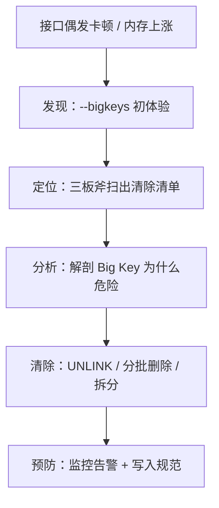

Redis 偶发卡顿、内存只涨不降，怀疑有 Big Key 却不知道从哪查起？本文用 Docker 搭一套可复现环境，亲手埋四颗典型的"内存炸弹"，手把手带你走完 Big Key 排查的第一步：「认识 → 埋雷 → 发现」。
<!-- more -->

# 前言：一个真实的场景

周二下午，你正在写需求，突然收到告警：用户中心接口的 P99 平时 50ms，最近却隔三差五飙到 2 秒。奇怪的地方在于——QPS 曲线很平稳，没有突增流量，代码也没有改动。查调用链，耗时段全部落在一次 Redis 的 HGETALL 上；打开 Redis 监控，内存一个月涨了 40%，延迟图上有零星的尖刺。运维看了一眼说："可能有 Big Key，你查查。"

你连上 redis-cli，问题来了：

```javascript
    什么是 Big Key？多大才算"大"？
    它在哪？库里几十万个 key，从哪找起？
    它为什么会让整个 Redis 一起卡？
```

这不是某一个人的困境。排查 Big Key 其实是一个有**标准流程**的工程问题，核心就四步：



本文的目标很实际：**读完之后，你能说清楚什么是 Big Key、亲手造出四种典型 Big Key、并用官方工具抓到第一个**。

为了让每个步骤都能动手验证，我会先在 Docker 里搭一套 Redis 8.2 环境，然后亲手埋四颗典型的"内存炸弹"——大 String、大 Hash、大 ZSet、大 List——再撒 10 万个正常 key 当掩护，最后用工具把炸弹一颗颗找出来。文中所有命令均可直接复制复现。

`环境说明：Redis 8.2（官方 Docker 镜像），客户端用 docker exec 进入容器执行 redis-cli；造数脚本用到 python3。`

# 什么是 Big Key：先立判定标准

Big Key 不是 Redis 的官方概念，而是社区对"体积过大的 key"的统称。所谓"大"，其实有两种，危险来源完全不同：

- **String 类型：value 的字节数大**。比如把整页 HTML、几 MB 的商品详情 JSON 塞进一个 key；
- **集合类型（Hash / List / Set / ZSet）：元素个数多**。比如一个 Hash 存了 100 万个 field。

业界常用的参考阈值（阿里 Java 开发手册同款约定）：

| 类型 | 参考阈值 | 典型业务场景 |
| --- | --- | --- |
| String | value 超过 10KB | 大 JSON、富文本、图片 Base64 |
| Hash | field 数超过 5000 | 用户画像、会话、配置全集 |
| List | 元素数超过 5000 | 消息队列、操作流水 |
| Set | 成员数超过 5000 | 标签池、抽奖池 |
| ZSet | 成员数超过 5000 | 排行榜、延时队列 |

两点说明：

1. **阈值不是铁律，和访问频率挂钩**。一个 10KB 的 key 每秒被读 10 万次，危害可能超过一个 1MB 但一天才读一次的 key；
2. **两种"大"伤的地方不一样**：字节大主要伤**网络**（一次读走几 MB），元素多主要伤**主线程**（删除和全量操作是 O(N)）。这句话先记住，第 3 篇会回来解剖它。

Big Key 也不是天生的，都是业务一点点喂大的，常见成因就四种：

- **缓存整个对象图**：一个 key 存整页 HTML、整个商品详情，字段越加越多；
- **列表只写不删**：消息队列消费失败堆积、操作日志无限 RPUSH；
- **集合无界增长**：排行榜上线三年没清过历史数据，标签池只加不减；
- **把 Redis 当数据库用**：全量业务数据常驻内存，还都堆在少数几个 key 里。

# 环境准备：5 分钟搭好实验环境

## 启动 Redis 8.2

一条命令搞定：

```bash
docker run -d --name redis8 -p 6379:6379 \
  -v redis8-data:/data \
  redis:8.2
```

参数说明：

| 参数 | 作用 |
| --- | --- |
| `--name redis8` | 容器名，后面 `docker exec` 要用 |
| `-p 6379:6379` | 宿主机 6379 映射到容器 6379 |
| `-v redis8-data:/data` | 数据卷持久化，删容器数据不丢 |

启动后验证：

```bash
docker ps
docker exec -i redis8 redis-cli PING
# PONG
```

## 埋四颗"炸弹"

注意：**这四颗炸弹是故意埋的"案发现场"**——它们就是全系列后面三篇的排查、解剖和清除对象。

先学一个本篇最重要的技巧：百万级写入必须用 redis-cli 的**管道模式**（`--pipe`），把命令按行从标准输入一次性灌进去，省掉每条命令的网络往返。裸循环写 100 万次 HSET 要按小时算，`--pipe` 只要几秒钟。

**A：大 String**——约 1MB 的商品详情 JSON：

```bash
python -c "import json; item={'id':1001,'name':'年度旗舰手机','detail':'这是一段商品详情。'*40000}; print(json.dumps(item))" | docker exec -i redis8 redis-cli -x SET product:detail:1001
```

`-x` 参数让 redis-cli 从标准输入读取 value，是塞大 value 的利器。

**B：大 Hash**——100 万 field 的用户画像：

```bash
python -c "for i in range(1000000): print(f'HSET user:profile:10086 field:{i} value:{i}')" | docker exec -i redis8 redis-cli --pipe
```

**C：大 ZSet**——100 万成员的全站排行榜：

```bash
python -c "for i in range(1000000): print(f'ZADD rank:global {i} player:{i}')" | docker exec -i redis8 redis-cli --pipe
```

**D：大 List**——50 万条堆积的消息队列：

```bash
python -c "for i in range(500000): print(f'RPUSH queue:msg message:{i}')" | docker exec -i redis8 redis-cli --pipe
```

## 撒 10 万正常 key 当对照组

真实的库不会只有 4 个 key。再撒 10 万个 session 小 key，模拟生产 keyspace——不然下一篇的"大海捞针"就没有"海"了：

```bash
python -c "for i in range(100000): print(f'SET session:{i} token:{i}')" | docker exec -i redis8 redis-cli --pipe
```



## 验证

```bash
docker exec -i redis8 redis-cli DBSIZE
# (integer) 100004

docker exec -i redis8 redis-cli INFO memory | grep used_memory_human
# used_memory_human:168.79M
```



再逐个称一下炸弹的"体重"：

```bash
docker exec -i redis8 redis-cli STRLEN product:detail:1001
# (integer) 2160076        -- 约 2MB

docker exec -i redis8 redis-cli HLEN user:profile:10086
# (integer) 1000000

docker exec -i redis8 redis-cli ZCARD rank:global
# (integer) 1000000

docker exec -i redis8 redis-cli LLEN queue:msg
# (integer) 500000
```



想看占多少内存，用 `MEMORY USAGE`：

```bash
docker exec -i redis8 redis-cli MEMORY USAGE user:profile:10086
# (integer) 64388704       -- 约 61MB
```

注意 `MEMORY USAGE` 是估算值（集合类型按内部编码推算），数字因环境而异，看量级就行。至此：四颗炸弹就位，10 万正常 key 作掩护，实验环境搭建完成。

# 发现第一颗 Big Key：--bigkeys 初体验

## 两个直觉线索

在掏出专业工具之前，两个命令能给你"第一感觉"：

**线索一：`INFO memory`**——内存涨得没道理。上面已经看过，10 万个小 session key 本该只占几十 MB，实际用了 260MB，多出来的就是炸弹。

**线索二：`INFO commandstats`**——看哪些命令在吃时间：

```bash
docker exec -i redis8 redis-cli INFO commandstats | grep -E 'cmdstat_(hset|zadd|rpush|set)'
```

```plain
cmdstat_zadd:calls=1000000,usec=780886,usec_per_call=0.78,rejected_calls=0,failed_calls=0
cmdstat_hset:calls=1000000,usec=649771,usec_per_call=0.65,rejected_calls=0,failed_calls=0
cmdstat_rpush:calls=1000000,usec=143217,usec_per_call=0.14,rejected_calls=0,failed_calls=0
cmdstat_set:calls=100001,usec=36517,usec_per_call=0.37,rejected_calls=0,failed_calls=0

```

逐字段读：`calls` 是调用次数，`usec` 是累计微秒数，`usec_per_call` 是平均单次耗时。如果线上某个命令的平均耗时异常高，就值得怀疑。但 commandstats 只告诉你"哪个命令慢"，告诉不了你"哪个 key 大"——找 key，得换工具。

## 跑起来：--bigkeys 输出逐段解读

Redis 自带的官方工具，开箱即用：

```bash
docker exec -i redis8 redis-cli --bigkeys
```

输出（数字因环境而异，重点看结构）：

```plain
# Scanning the entire keyspace to find biggest keys as well as
# average sizes per key type.  You can use -i 0.1 to sleep 0.1 sec
# per 100 SCAN commands (not usually needed).

[00.00%] Biggest string found so far "session:56238" with 11 bytes
[25.00%] Biggest string found so far "product:detail:1001" with 2160076 bytes
[27.76%] Biggest list   found so far "queue:msg" with 500000 items
[53.65%] Biggest zset   found so far "rank:global" with 1000000 members
[82.62%] Biggest hash   found so far "user:profile:10086" with 1000000 fields

-------- summary -------

Sampled 100004 keys in the keyspace!
Total key length in bytes is 1288947 (avg len 12.89)

Biggest   list found "queue:msg" has 500000 items
Biggest   hash found "user:profile:10086" has 1000000 fields
Biggest string found "product:detail:1001" has 2160076 bytes
Biggest   zset found "rank:global" has 1000000 members

1 lists with 500000 items (00.00% of keys, avg size 500000.00)
1 hashs with 1000000 fields (00.00% of keys, avg size 1000000.00)
0 streams with 0 entries (00.00% of keys, avg size 0.00)
100001 strings with 3248966 bytes (100.00% of keys, avg size 32.49)
0 sets with 0 members (00.00% of keys, avg size 0.00)
1 zsets with 1000000 members (00.00% of keys, avg size 1000000.00)
```



三段式解读：

1. **开头提示**：它会扫遍整个 keyspace；`-i 0.1` 参数可以让它每 100 次 SCAN 睡 0.1 秒——线上怕影响就加上；
2. **过程中的 `found so far`**：扫到更大的就刷新纪录，百分比是扫描进度；
3. **结尾 summary**：每种类型各报一个"冠军"。注意细节——**String 报字节数，集合报元素个数**，两个口径不一样，第 3 篇会回来算这笔账。

战果：四颗炸弹全部上榜，第一关完成。

## 关键认知 1：它只报"每类冠军"

别急着收工，现场做个实验——再埋一颗 50 万 field 的 Hash：

```bash
python -c "for i in range(500000): print(f'HSET user:profile:10087 field:{i} value:{i}')" | docker exec -i redis8 redis-cli --pipe
```

重跑 `--bigkeys`：Hash 冠军依然是 `user:profile:10086`，而 50 万 field 的 `user:profile:10087` 在报告里**完全隐身**。



这就是 `--bigkeys` 的天花板：**每种类型只留一个冠军，亚军季军全部漏网**。线上如果"用户画像"这类 key 普遍偏大，你只能看到最大的那一个——剩下的全是漏网的定时炸弹。

## 关键认知 2：底层是 SCAN，不阻塞但吃 CPU

`--bigkeys` 不是魔法。它底层就是 SCAN 家族：SCAN 遍历 keyspace，对每个 key 按类型调 STRLEN / HLEN / LLEN / SCARD / ZCARD。所以它：

- **不阻塞主线程**——SCAN 是游标分批推进的，主线程随时能插进来处理别的命令；
- **但 CPU 开销实打实**——全量扫一遍 keyspace，线上请在低峰执行，必要时加 `-i` 限速。

留下本篇最后一个问题：10 万个 key 里，怎么把**所有**超过阈值的 Big Key 一个不漏地找出来，再按危害排个优先级？这是下篇的三板斧。

# 三个必踩的坑

## 坑 1：报告"每类冠军" ≠ 全部 Big Key

上面的实验就是结论：靠 `--bigkeys` 出排查清单，漏报是常态。`user:profile:10087` 现在还藏在 10 万 key 中间逍遥法外。想要全量清单，得用 SCAN 脚本或离线分析 RDB——下篇的主角。

## 坑 2：字节大 ≠ 危险，元素多才是删除阻塞的根源

直觉上，1MB 的 String 比 100 万 field 的 Hash 更"大"。但对 Redis 主线程来说，恰恰相反。实测（用一次性 key，不动四颗炸弹）：

```bash
# 造一颗一次性的 100 万 field Hash
python -c "for i in range(1000000): print(f'HSET tmp:big:hash f:{i} v:{i}')" | docker exec -i redis8 redis-cli --pipe

# 掐表删它
time docker exec -i redis8 redis-cli DEL tmp:big:hash
```

```plain
(integer) 1
real    0m0.412s
```



**0.4 秒！**（机器性能不同数字会浮动，老一点的机器上能到 1 秒多。）这 0.4 秒里主线程在逐个 field 释放内存，**所有其他命令都在排队等待**。实验库只有 100 万 field；线上如果是 500 万 field 的 Hash，一删就是 2 秒起步——这就是本文开头"P99 偶发飙到 2 秒"的标准剧本。

对比组：删一个 1MB 的 String，`real` 里几乎全是 docker exec 的启动开销，服务端执行是微秒级的事：

```bash
python -c "print('x' * 1000000)" | docker exec -i redis8 redis-cli -x SET tmp:big:string
time docker exec -i redis8 redis-cli DEL tmp:big:string
# real    0m0.295s
```



等等——**0.295 秒？**String 释放一块连续内存是 O(1)，微秒级的事，怎么也测出 0.3 秒？

这是 Windows 下的经典假象：`time` 掐的是整条 `docker exec` 命令的耗时，而 Windows（Git Bash / WSL）下启动一次 docker exec 本身就要 0.3 秒左右——两次测量里的大头都是启动开销，服务端真实执行时间被完全淹没。（Linux 下这个开销只有几十毫秒，干扰小得多。）

想拿到服务端真实耗时，得让 Redis 自己汇报——慢日志。慢日志的统计口径正是服务端执行时间（默认阈值 10ms，超过才记录）。String 那次 DEL 连阈值都够不着，查无此人；而 Hash 那次 DEL 已经留下了案底：

```bash
docker exec -i redis8 redis-cli SLOWLOG GET 1
```

```plain
2
1789609033
111211
DEL
tmp:big:hash
127.0.0.1:56310
```



逐行读这条案底：第 1 行是日志 ID，第 2 行是 Unix 时间戳，**第 3 行最关键——111211 微秒 ≈ 0.11 秒，这才是服务端真实删除耗时**（前面 `time` 测出的 0.412 秒里，另外 0.3 秒正是 docker exec 的启动开销），第 4、5 行是完整命令，最后一行是客户端地址。

账本齐了：100 万 field 的 Hash，真实删除耗时 **0.11 秒**（机器越好越快，老机器上能到 1 秒多）；1MB 的 String，连 10ms 阈值都没到，微秒级。**字节大 ≠ 危险，元素多才是删除阻塞的根源**。实验库只有 100 万 field；线上如果是 500 万 field 的 Hash，一删就是秒级——这就是本文开头"P99 偶发飙到 2 秒"的标准剧本。

为什么元素多就慢？删集合要逐个释放元素的内存，O(N)；删 String 只释放一块连续内存，O(1)。更深层的解剖——单线程事件循环、过期大 key 的隐形删除、Cluster 数据倾斜——留给第 3 篇。

## 坑 3：生产环境别随手 KEYS *

想知道库里有什么 key，第一反应可能是：

```bash
docker exec -i redis8 redis-cli KEYS '*'
```

实验库 10 万个 key，它几十毫秒就返回了，看起来人畜无害。但 KEYS 是 **O(N) 全量遍历 + 一次性返回全部结果**：线上 5000 万个 key，主线程卡几秒不说，返回结果还能瞬间撑爆输出缓冲。相当于为了找一本书，把整个图书馆封锁一遍。

线上的安全姿势是 SCAN 家族（`--bigkeys` 底层同款）：

```bash
docker exec -i redis8 redis-cli SCAN 0 COUNT 100
```

```plain
1) "17216"
2)  1) "session:83124"
    2) "session:10293"
    ...
```

返回一个游标 + 一小批 key，下次拿返回的游标接着扫，直到游标归 0 才算扫完。化整为零，主线程随时能插进来干活。

# 小结

本篇的标准动作，一句话：

**立判定标准（两种"大"）→ Docker 搭环境、埋四颗炸弹 → `--bigkeys` 抓到第一个 Big Key，同时认清它"只报每类冠军"的天花板。**

但 `--bigkeys` 只交出了冠军榜：那颗 50 万 field 的 `user:profile:10087` 还藏在 10 万 key 里。下一篇上三板斧——`--memkeys`、SCAN 全量脚本、RDB 离线分析——把所有 Big Key 一个不漏地扫出来，排成一份《清除优先级清单》：《几十万个 key 扫不过来？--bigkeys、SCAN、RDB 离线分析三步定位最该清的 Big Key》。