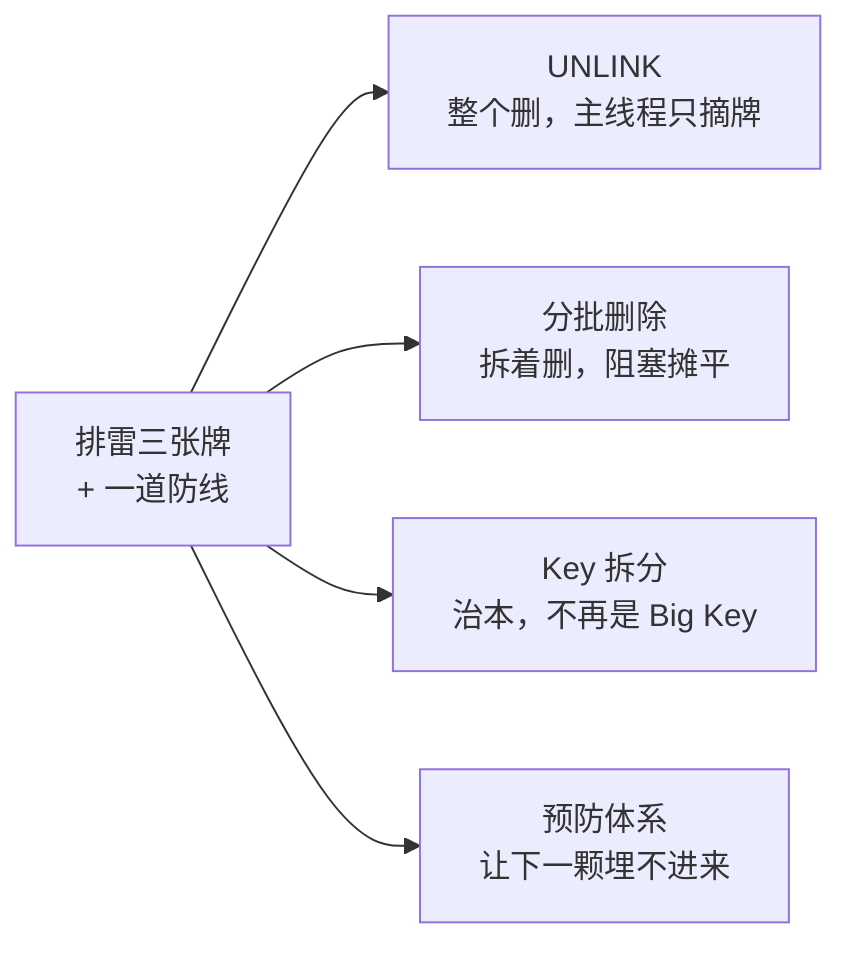
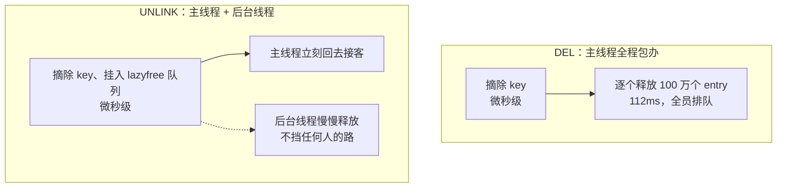
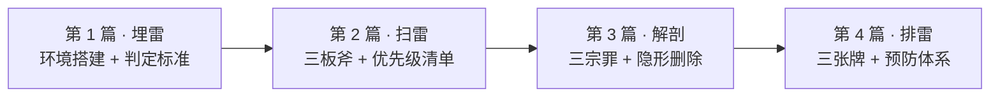

> Redis Big Key 系列 · 第 4 篇（收官）。上一篇把 Big Key 的三宗罪送上了解剖台：删除阻塞、读放大、隐形删除（没看过的建议先读：[《一个 DEL 卡了 1 秒：Big Key 危害的解剖报告——单线程阻塞、过期隐形删除与数据倾斜》](https://nanoyeluo.github.io/2026/09/19/%E4%B8%80%E4%B8%AA-DEL-%E5%8D%A1%E4%BA%86-1-%E7%A7%92%EF%BC%9ABig-Key-%E5%8D%B1%E5%AE%B3%E7%9A%84%E8%A7%A3%E5%89%96%E6%8A%A5%E5%91%8A%E2%80%94%E2%80%94%E5%8D%95%E7%BA%BF%E7%A8%8B%E9%98%BB%E5%A1%9E%E3%80%81%E8%BF%87%E6%9C%9F%E9%9A%90%E5%BD%A2%E5%88%A0%E9%99%A4%E4%B8%8E%E6%95%B0%E6%8D%AE%E5%80%BE%E6%96%9C/#more)）。病因清楚了，这篇动手术：把第 2 篇清单上的 10 颗炸弹**全部安全拆除**，顺带把"治本"和"预防"一次讲透。
> <!-- more -->

# 前言：清单在手，开始排雷

回顾第 2 篇产出、第 3 篇校准过的清单。注意 ZSet 和 List 的 DEL 耗时还挂着"按元素个数推算"的债——本篇第一件事就是还账：

| 排名 | key | 类型 | 规模 | DEL 耗时 | 优先级 |
| --- | --- | --- | --- | --- | --- |
| 1 | rank:global | ZSet | 100 万成员 / 87MB | 待实测（本篇收债） | P0 |
| 2 | user:profile:10086 | Hash | 100 万 field / 61MB | 112ms | P0 |
| 3 | user:profile:10087 | Hash | 50 万 field / 31MB | 40ms | P1 |
| 4 | queue:msg | List | 50 万元素 / 6.5MB | 待实测（本篇收债） | P1 |
| 5 | user:profile:10088~10092 | Hash ×5 | 各 10 万 field | 4.6ms | P2 |
| 6 | product:detail:1001 | String | 2MB | 微秒级 | P3 |

本篇手里的牌：



拆除顺序按优先级走，每颗炸弹配最适合它的刀。环境沿用上三篇（Docker + Redis 8.2，容器 `redis8`），所有命令可直接复制复现。

# 拆弹一：UNLINK——把释放踢给后台线程

## 原理：主线程摘牌，后台收尸

第 3 篇解剖过 DEL 卡住的机理：O(N) 逐个 free，主线程全程不放手。UNLINK 的思路是**把释放这个重活外包**：



关键在"摘除"这一步：不管 key 里有 100 个还是 100 万个元素，主线程要做的都只是把这个 key 的 value 对象从主字典里摘出来、挂到后台队列——**耗时和元素个数基本无关**。真正的那 100 万次 free，由后台线程慢慢干。从客户端视角 key 立刻消失（EXISTS 返回 0），但内存是**稍后**才归还的——先记住这点，[坑 1](#坑-1：UNLINK-后内存没马上降，别慌) 要用。
 
## 实测对照：DEL vs UNLINK

造一颗和第 3 篇同规格的 100 万 field Hash，这次用 UNLINK 拆：

```bash
python -c "for i in range(1000000): print(f'HSET tmp:bench:unlink f:{i} v:{i}')" | docker exec -i redis8 redis-cli --pipe > /dev/null

# 老姿势：慢日志阈值调 0，让 Redis 自己汇报
docker exec -i redis8 redis-cli CONFIG SET slowlog-log-slower-than 0
docker exec -i redis8 redis-cli UNLINK tmp:bench:unlink
docker exec -i redis8 redis-cli SLOWLOG GET 1
# 案底：1 / 1789866376 / 21 / UNLINK / tmp:bench:unlink
# 耗时字段：21 微秒 —— 100 万 field 的 Hash，主线程只停了 21µs
```



顺手把第 2 篇的债还了——ZSet 和 List 的删除成本。用替身法：再造一颗 100 万成员的 ZSet 和一颗 50 万元素的 List 挨 DEL；正主 `rank:global` 和 `queue:msg` 直接用 UNLINK 拆除（正戏顺便当实验）：

```bash
# 替身就位：100 万成员 ZSet + 50 万元素 List
python -c "for i in range(1000000): print(f'ZADD tmp:bench:zset {i} m:{i}')" | docker exec -i redis8 redis-cli --pipe > /dev/null
python -c "for i in range(500000): print(f'RPUSH tmp:bench:list item:{i}')" | docker exec -i redis8 redis-cli --pipe > /dev/null
# UNLINK 前先看一眼内存（坑 1 的伏笔）
docker exec -i redis8 redis-cli INFO memory | grep used_memory_human

# 逐个处刑
docker exec -i redis8 redis-cli DEL tmp:bench:zset
docker exec -i redis8 redis-cli DEL tmp:bench:list
docker exec -i redis8 redis-cli UNLINK rank:global     # P0 正主，拆除
docker exec -i redis8 redis-cli UNLINK queue:msg       # P1 正主，拆除
docker exec -i redis8 redis-cli SLOWLOG GET 5
# 案底五连（含一条乱入的 INFO memory——阈值 0 记录一切，它就是活证据）：
#   1500009 / 17µs    / UNLINK / queue:msg
#   1500008 / 18µs    / UNLINK / rank:global
#   1500007 / 102µs   / DEL    / tmp:bench:list
#   1500006 / 46864µs / DEL    / tmp:bench:zset
#   1500005 / 26µs    / INFO   / memory
```

**速查表 1：DEL vs UNLINK 耗时对照（全部实测）**

| key | 类型 | 规模 | DEL | UNLINK |
| --- | --- | --- | --- | --- |
| tmp:bench:* | Hash | 100 万 field | 112ms（第 3 篇实测） | **21µs** |
| tmp:bench:zset / rank:global | ZSet | 100 万成员 | **47ms** | **18µs** |
| tmp:bench:list / queue:msg | List | 50 万元素 | **0.1ms** | **17µs** |

两个预判全部命中，而且都比预期狠：

1. **UNLINK 把主线程耗时压到微秒级，且与类型、个数双双脱钩**——21µs（Hash 100 万）、18µs（ZSet 100 万）、17µs（List 50 万），三颗炸弹三种类型，全部 20µs 上下。对照 DEL 的 112ms / 47ms / 0.1ms，最多差了 5000 多倍。"主线程只是摘了个牌"，实锤；
2. **List 的 DEL 便宜得离谱**——预判 10ms，实测 **102µs**，又低了两个数量级。quicklist 按节点整块释放：50 万元素装在几十个节点里，free 只要几十次，而不是 50 万次。所以结论要修正：**List 型 Big Key 的删除阻塞风险天然很低，它的危害在内存和读，不在删**——第 2 篇给 `queue:msg` 排 P1，真正该担心的是它那 6.5MB 的内存和潜在的整体读取，DEL 反而是最不可怕的。

顺带把第 2 篇的账结清：ZSet 推算 ~0.1s 实测 47ms，List 推算 ~50ms 实测 0.1ms——按元素个数线性外推对 Hash、ZSet 有效，对 quicklist 结构的 List 会高估三个数量级。

## lazyfree-lazy-user-del：让老代码零改造

业务代码里已经写死的 `DEL` 怎么办？不用改代码，一个开关：

```bash
docker exec -i redis8 redis-cli CONFIG SET lazyfree-lazy-user-del yes
```

之后所有 DEL 自动变成异步删除——慢日志里命令名还记 DEL，耗时字段却掉到微秒级。这就是第 3 篇开关矩阵里"混了个脸熟"的那位。默认值是 **no**，要不要开、开了有什么代价，[坑 2](#坑-2：lazyfree-lazy-user-del-不是免费午餐) 里细说。

# 拆弹二：分批删除——不能整个删时的手术刀

UNLINK 很香，但有三种场景它管不了：

1. **只删部分元素**——比如清掉榜单 90 万名以后的成员，保留 Top 10 万；
2. **老版本没有 UNLINK**——4.0 之前的 Redis 只能硬删；
3. **谨慎到想控制每一毫秒**——把一次大阻塞摊成几百次微停顿，比 UNLINK 更平滑。

四种类型，四种刀法：

**速查表 2：分批删除刀法**

| 类型 | 分批姿势 | 每批建议 |
| --- | --- | --- |
| Hash | HSCAN 游标 + HDEL | 500~1000 field |
| ZSet | ZREMRANGEBYRANK key 0 -1001 | 每批 1000 成员 |
| List | LPOP 循环 / LTRIM 截断 | 500~1000 元素 |
| Set | SSCAN 游标 + SREM | 500~1000 成员 |

实战：P1 的 `user:profile:10087`（50 万 field，整体 DEL 要堵 40ms）上手术台：

```python
# batch_delete.py
import redis, time

r = redis.Redis(port=6379)
cursor, total = 0, 0
while True:
    cursor, fields = r.hscan('user:profile:10087', cursor, count=1000)
    if fields:
        r.hdel('user:profile:10087', *fields.keys())
        total += len(fields)
    time.sleep(0.01)              # 批间让出主线程，这行是灵魂
    if cursor == 0:
        break
print('deleted:', total)
```

```bash
time python batch_delete.py
# deleted: 500000
# real    0m30.262s        -- 实测，比估算的 8s 慢了近 4 倍，下面拆账

# 验证：每批的耗时到底是多少？
docker exec -i redis8 redis-cli SLOWLOG GET 5

# 收尾：阈值调回默认 10ms（实验姿势，别带上生产）
docker exec -i redis8 redis-cli CONFIG SET slowlog-log-slower-than 10000
```
 

实测 30.26 秒，先拆账——500 批跑下来平均每批 60ms，而标称节奏是 10ms，钱花在哪：

1. **Windows 的 `sleep` 睡不准**：`time.sleep(0.01)` 受系统时钟粒度限制（默认约 15.6ms），想睡 10ms 常常睡成 15~25ms——这是 Windows 特有的坑，Linux 上准得多；
2. **Docker Desktop 的网络税**：Windows 下容器流量走虚拟网卡端口转发，每个 RTT 都比 Linux 原生 docker 贵，每批 HSCAN + HDEL 就是两个来回；
3. 服务端 HDEL 1000 个 field 本身不到 1ms，不是大头。

也就是说这 30 秒里，**真正占用 Redis 主线程的时间加起来不到 1 秒，其余全花在"等"上**——这正是分批想要的效果：主线程的负担没有变重，只是你的耐心被摊薄了。生产上在 Linux 服务器跑同样的脚本，节奏会接近标称的 10ms/批。

"每批不到 1ms"这个数字不是推算，是账本公开的。这里有个歪打正着：跑批删时慢日志阈值还是前面实验调的 0（忘了调回去），于是 500 批 × 2 条命令，1000 条案底一条不落全在——随手抽 5 条：




```plain
1501013  HDEL    384µs
1501012  HSCAN   312µs
1501011  HDEL    532µs
1501010  HSCAN   478µs
1501009  HDEL    421µs
```

**没有一条超过 1ms，离 10ms 的默认阈值差着 20 倍**——就算阈值一直是 10ms，这 1000 条也一条都别想上榜。注意这是比"查无记录"更强的证据：不是抓不到，是账本摊开随便审计，每一笔都清清白白。这就是分批的哲学：用时间换平滑。

两个提醒：`time.sleep(0.01)` 那行是灵魂，不 sleep 的分批等于没分批，主线程照样被你一个人占着；另外这个脚本有个隐蔽缺陷——边扫边删可能删不干净，先跑，[坑 3](#坑-3：边扫边删的游标陷阱) 里再拆它的雷。

# 拆弹三：Key 拆分——治本的架构手术

前两招都是"拆炸弹"，但业务还在写——`user:profile:10086` 清了，明年又会长回 61MB。Big Key 几乎都是"一开始很小"的 key 慢慢长成的。治本只有一条路：**让每颗 key 回到阈值以内**（第 1 篇的阿里手册约定还记得吗：String > 10KB、集合 > 5000 元素就该警惕）。

## 实战：100 万 field 的 Hash 拆成 64 份

思路：按 `crc32(field) % 64` 把 field 散到 64 颗小 Hash 里。注意脚本里 HSCAN **只读不删**，旧 key 最后整体 UNLINK——这是绕开游标陷阱的标准姿势：

```python
# split_hash.py
import redis, zlib

r = redis.Redis(port=6379)
SHARDS = 64
cursor, moved = 0, 0
while True:
    cursor, fields = r.hscan('user:profile:10086', cursor, count=1000)
    if fields:
        pipe = r.pipeline(transaction=False)
        for f, v in fields.items():
            shard = zlib.crc32(f) % SHARDS
            pipe.hset(f'user:profile:10086:{shard:02d}', f, v)
        pipe.execute()
        moved += len(fields)
    if cursor == 0:
        break
print('moved:', moved)
```

```bash
python split_hash.py
# moved: 1000000

# 旧 key 摘除，验收新 key
docker exec -i redis8 redis-cli UNLINK user:profile:10086
docker exec -i redis8 redis-cli MEMORY USAGE user:profile:10086:00
docker exec -i redis8 redis-cli MEMORY USAGE user:profile:10086:63
```



预期每颗小 Hash 约 1MB（61MB ÷ 64 ≈ 0.96MB，jemalloc 档位取整再加点）——对照第 2 篇的清单口径，连 P2 都够不上，从 P0 危险品直接降级成路人甲。

读写侧跟着改一行路由：

```python
def profile_key(field: str) -> str:
    return f'user:profile:10086:{zlib.crc32(field.encode()) % 64:02d}'
```

读单个 field 还是一次 HGET，零损耗。但**聚合查询变贵了**：全量拉一个用户的 profile，从 1 次 HGETALL 变成 64 次——读扩散，这是拆分躲不掉的代价。

## 其他类型怎么拆（速查表 3）

| 类型 | 拆法 | 代价 |
| --- | --- | --- |
| Hash | 按 field 哈希取模拆 N 份 | 聚合读扩散；原子性丢失 |
| ZSet 榜单 | 按时间窗拆（rank:202609、rank:202610）+ 定时合并 | 跨时间窗榜单要额外合并计算 |
| List 队列 | 拆多个队列，生产者轮询/哈希投递，消费者多队列轮询 | 顺序性只能保证单队列内 |
| 大 String | 压缩（Snappy 等）/ 按字段组拆成 Hash / 转对象存储存 URL | 多一次解压 CPU 或网络 IO |

还有个隐性成本：拆分后**总内存会微涨**——64 颗 key 各自背着字典表头和扩容档位的浪费（第 2 篇讲 Hash"同规格不同体重"的账，这里要还利息）。所以拆分粒度不是越细越好，64 也不是魔法数字，按"单 key 降回阈值内"反推就够了。

# 预防体系：让下一颗炸弹埋不进来

拆完 10 颗，别让第 11 颗进来。三道防线：

1. **写入侧卡口**：业务代码对 value 大小、集合长度做校验，超阈值告警或拒绝；Code Review checklist 加一条——"这个 key 会随时间、随用户量长到多大？"
2. **监控侧巡检**：第 2 篇的 SCAN 脚本包成定时任务，每天低峰跑一遍，超阈值告警；慢日志盯 DEL/HGETALL 类命令；`used_memory` 增长率突变告警——内存曲线比任何工具都诚实；
3. **配置侧收口**：`lazyfree-lazy-expire` 默认 yes 保持不动；`lazyfree-lazy-user-del` 评估后开启（权衡见坑 2）；`maxmemory-policy` 别用 noeviction 裸奔——第 3 篇说过，驱逐大 key 时主线程同步卡死，还查无此人。

# 三个必踩的坑

## 坑 1：UNLINK 后内存没马上降，别慌

拆弹一里埋了伏笔，这里正式演示。不过得先请个替身——`rank:global` 在拆弹一已经拆除了（别笑，我们第一次演示就翻车了：UNLINK 一个已不存在的 key 返回 0，内存纹丝不动，和 DEL 的语义一致）。再造一颗同规格的 100 万成员 ZSet，先来第一轮：

```bash
python -c "for i in range(1000000): print(f'ZADD tmp:mem:demo {i} m:{i}')" | docker exec -i redis8 redis-cli --pipe > /dev/null

docker exec -i redis8 redis-cli INFO memory | grep used_memory_human
# used_memory_human:192.86M     -- 替身就位
docker exec -i redis8 redis-cli UNLINK tmp:mem:demo
# 1
docker exec -i redis8 redis-cli INFO memory | grep used_memory_human
# used_memory_human:103.08M     -- 咦？87MB 已经降完了
sleep 5
docker exec -i redis8 redis-cli INFO memory | grep used_memory_human
# used_memory_human:103.08M     -- 纹丝不动
```

第二轮翻车实录如上：剧本写的是"刚删完没降、几秒后才降"，实测是敲完下一条命令时 87MB 已经还完了——**后台线程释放 87MB 只要零点几秒，比你敲键盘快得多**，交互式逐条敲命令注定扑空。想抓住"延迟归还"的现场，得换个姿势：把 UNLINK 和 INFO 塞进**同一条连接**连发（redis-cli 从 stdin 逐行读命令，两条命令之间只隔微秒级），再盯一个比 `used_memory` 更直接的字段——`lazyfree_pending_objects`，还在后台队列里排队等释放的对象数：

```bash
# 替身再造一颗，先看基线
python -c "for i in range(1000000): print(f'ZADD tmp:mem:demo {i} m:{i}')" | docker exec -i redis8 redis-cli --pipe > /dev/null
docker exec -i redis8 redis-cli INFO memory | grep used_memory_human

# 同一条连接里 UNLINK + INFO 连发
printf 'UNLINK tmp:mem:demo\nINFO memory\n' | docker exec -i redis8 redis-cli | grep -E "used_memory_human|lazyfree_pending_objects"
# used_memory_human:~190M        -- 估算：刚 UNLINK 完，内存还没还
# lazyfree_pending_objects:1     -- 估算：释放任务正挂在队列里

sleep 5
docker exec -i redis8 redis-cli INFO memory | grep -E "used_memory_human|lazyfree_pending_objects"
# used_memory_human:~103M        -- 估算：还回来了
# lazyfree_pending_objects:0     -- 估算：队列清空
```



**UNLINK 是"key 立刻消失，内存稍后归还"**——释放是后台线程干的，`lazyfree_pending_objects` 就是它的工作队列长度。生产上有人 UNLINK 完一看内存没动，以为没删成功，又删一遍、甚至重启实例，都是这个坑的受害者。验收 UNLINK 的标准是 `EXISTS` 返回 0，不是内存立刻下降。

## 坑 2：lazyfree-lazy-user-del 不是免费午餐

这个开关**全局生效**：一开，所有 DEL 都异步化。两个代价要想清楚：

1. **内存回收时机全局后移**——如果你的业务指望"DEL 立刻腾出内存给下一笔写入"（内存水位已经很紧张时），异步化会让水位短暂冲高；
2. **小 key 也被裹挟**——DEL 一颗小 key 本来纳秒级的事，现在多了入队、出队的开销。微秒级，可以忽略，但它确实存在。

大多数业务开了利大于弊，但开之前两个动作：第 3 篇教的 `CONFIG GET lazyfree-lazy-*` 确认当前值；重要变更翻一遍官方文档。

## 坑 3：边扫边删的游标陷阱

拆弹二的脚本我留了个雷：HSCAN 途中 HDEL。第 2 篇说过 SCAN 家族不保证遍历一致性——删除元素可能触发哈希表缩容、rehash，正在走的游标会乱，**部分 field 被跳过，一遍扫完删不干净**。稳妥姿势两种：

1. **只读迁移 + 整体 UNLINK**——拆弹三的拆分脚本就是这个姿势，遍历期间旧 key 一个元素不动；
2. **外层套 EXISTS 循环，扫到 key 消失为止**：

```python
while r.exists('user:profile:10087'):
    cursor = 0
    while True:
        cursor, fields = r.hscan('user:profile:10087', cursor, count=1000)
        if fields:
            r.hdel('user:profile:10087', *fields.keys())
        time.sleep(0.01)
        if cursor == 0:
            break
```

顺便再说一遍：批间不 sleep，分批就等于没分批。节奏和正确性，都是慢出来的。

# 小结：系列收官

销号仪式——清单上剩下的炸弹一次清完：

```bash
# P2 五颗 + P3 一颗，UNLINK 连发
docker exec -i redis8 redis-cli UNLINK user:profile:10088 user:profile:10089 user:profile:10090 user:profile:10091 user:profile:10092 product:detail:1001

# 顺手清扫实验残留（第 3 篇覆盖写实验的 tmp:cover）
docker exec -i redis8 redis-cli DEL tmp:cover

docker exec -i redis8 redis-cli DBSIZE
# 100064 —— 炸弹清零
```



对一下账：DBSIZE 没有回到整数 100000，多出来的 64 颗是拆弹三的拆分产物 `user:profile:10086:00`~`:63`——它们单颗只有 1MB 级，不再是炸弹，而是新秩序下的合法公民。10 万噪音 key + 64 颗小 Hash，一颗不多一颗不少。

最终战报：

| key | 拆除方式 | 耗时/效果 |
| --- | --- | --- |
| rank:global | UNLINK | 主线程 18µs（实测） |
| user:profile:10086 | 拆分 64 份 + UNLINK | 单颗降至 ~1MB，P0 → 路人甲 |
| user:profile:10087 | 分批 HDEL | 30s 全程平滑（实测） |
| queue:msg | UNLINK | 主线程 17µs（实测） |
| user:profile:10088~10092 | UNLINK ×5 | 微秒级 |
| product:detail:1001 | UNLINK | 微秒级 |

三张牌各一句话：**UNLINK** 管整个删，主线程微秒级走人；**分批删除** 管拆着删，用时间换平滑；**Key 拆分** 管治本，让 key 不再是 Big Key；**预防体系** 管未来，让下一颗炸弹埋不进来。

四篇走完一条完整的流水线：



Big Key 没有银弹，有的是流程：发现它、定位它、理解它、拆掉它、防住它。你的 Redis 现在干净了——保持住。