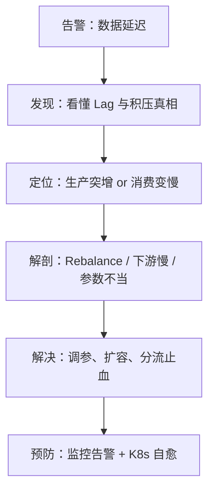

线上数据同步延迟几十分钟，应用没报错、没重启，运维说"Kafka 堵了"你却不知道从哪里查起？本文用 Docker 搭一套可复现环境，亲手制造一次消费积压，手把手带你走完积压排查的第一步：「认识 → 制造 → 观测」。
<!-- more -->

# 前言：一个真实的场景

周六晚上十点，你正在陪家人看电影，告警群突然刷屏：订单状态同步延迟超过 40 分钟，已经有用户投诉"付了钱订单还是待支付"。你爬起来打开电脑，查了一圈：应用日志干干净净，没有报错、没有重启、没有 Full GC。正当你怀疑人生的时候，运维在群里说了一句："查了，是 Kafka 堵了，你们消费组的 Lag 很高。"

你连上 Kafka，问题来了：

```
    什么是 Lag？多少才算"高"？
    积压在哪个 topic、哪个分区？从哪看起？
    是生产太快，还是消费太慢？现在该不该重启消费者？
```

这不是某一个人的困境。排查消费积压其实是一个有**标准流程**的工程问题，核心就五步：



本文的目标很实际：**读完之后，你能说清楚什么是 Lag、亲手造出一次积压、并用三种姿势把它看个明白**。

为了让每一步都能动手验证，我会先用 Docker 起一套 Kafka 环境，然后亲手埋一颗"消费雷"——灌 10 万条消息，再启动一个故意变慢的 Spring Kafka 消费者——最后眼睁睁看着 Lag 涨上天。文中所有命令均可直接复制复现。

`环境说明：Kafka 4.0（官方 Docker 镜像，KRaft 模式——ZooKeeper 已在 4.0 被彻底移除），kafka-ui 做可视化面板；消费者给 Spring Kafka 和 Python 两个版本，任选一个即可。`

# 什么是 Lag：先立判定标准

Kafka 的每个分区就是一条有序日志：**生产者往末尾追加消息，末尾位置叫 LOG-END-OFFSET；消费者记录自己读到哪了，这个位置叫 CURRENT-OFFSET（已提交位点）**。两者之差，就是 Lag：

```
Lag = LOG-END-OFFSET - CURRENT-OFFSET
```

画个图就明白了：

```
分区内部（一条有序日志）：

     消费者读到这里                      生产者写到这里
           ↓                                 ↓
   [0] [1] [2] …… [150]  ……  [8332] [8333]
                     └────── 中间的差距 ──────┘
                          = LAG（积压量）
```

定义一句话就能说完，但**怎么用**才是关键。三条认知先立住，整个系列都会反复用到：

1. **Lag 是相对值，不是绝对值。** 1 万 Lag 对一个 1000 msg/s 的 topic 是 10 秒的事，对一个 10 msg/s 的 topic 是 16 分钟。所以比 Lag 更有意义的指标是：**预计消化时长 = Lag ÷ 消费速率**。先记住这个公式，第 6 篇讲告警规则时会回来用它。
2. **Lag 高 ≠ 消费者挂了。** 消费者进程在线、日志没有报错，Lag 照样涨——消费变慢也是积压，而且更隐蔽。这是第 3、4 篇要解剖的对象。
3. **Lag 是消费健康的唯一金标准。** 应用日志会说谎（没报错 ≠ 没问题），Lag 不会。积压排查的一切动作，都从看 Lag 开始。

再用一个水池模型把"积压"讲透：**topic 是水池，生产是进水管，消费是出水管。积压的数学条件只有一个——进水速率 > 出水速率，且持续。** 这句话看着像废话，但它是第 2 篇"分诊"的全部基础：要么是进水突然变快（生产突增），要么是出水变慢（消费变慢），处置方式完全相反。

最后辨清三个容易混的概念：

| 概念 | 一句话解释 |
|--------|--------|
| Lag | 还差多少条没消费（单位：条数） |
| 预计消化时长 | 按当前消费速度，多久能追平（Lag ÷ 消费速率） |
| offset（位点） | 分区里每条消息的编号，消费者靠提交它记录进度 |

# 环境准备：5 分钟搭好实验环境

## 一键启动 Kafka + 可视化面板

Kafka 4.0 已经彻底告别 ZooKeeper，单容器就是一个完整集群。把下面这段存成 `docker-compose.yml`：

```yaml
services:
  kafka:
    image: apache/kafka:4.0.0
    container_name: kafka
    ports:
      - "29092:29092"   # 宿主机访问入口
    environment:
      KAFKA_NODE_ID: 1
      KAFKA_PROCESS_ROLES: broker,controller
      KAFKA_LISTENERS: PLAINTEXT://0.0.0.0:9092,PLAINTEXT_HOST://0.0.0.0:29092,CONTROLLER://0.0.0.0:9093
      KAFKA_ADVERTISED_LISTENERS: PLAINTEXT://kafka:9092,PLAINTEXT_HOST://localhost:29092
      KAFKA_LISTENER_SECURITY_PROTOCOL_MAP: PLAINTEXT:PLAINTEXT,PLAINTEXT_HOST:PLAINTEXT,CONTROLLER:PLAINTEXT
      KAFKA_CONTROLLER_LISTENER_NAMES: CONTROLLER
      KAFKA_CONTROLLER_QUORUM_VOTERS: 1@localhost:9093
      KAFKA_OFFSETS_TOPIC_REPLICATION_FACTOR: 1
      KAFKA_GROUP_INITIAL_REBALANCE_DELAY_MS: 0
      CLUSTER_ID: MkU3OEVBNTcwNTJENDM2Qk
    volumes:
      - kafka-data:/var/lib/kafka/data

  kafka-ui:
    image: provectuslabs/kafka-ui:latest
    container_name: kafka-ui
    ports:
      - "8080:8080"
    environment:
      KAFKA_CLUSTERS_0_NAME: local
      KAFKA_CLUSTERS_0_BOOTSTRAPSERVERS: kafka:9092
    depends_on:
      - kafka

volumes:
  kafka-data:
```

参数说明：

| 参数 | 作用 |
|--------|--------|
| `KAFKA_PROCESS_ROLES: broker,controller` | 单机同时扮演 broker 和 controller（KRaft 模式） |
| `KAFKA_LISTENERS` 里三个监听器 | 容器内 9092、宿主机 29092、controller 专用 9093 |
| `KAFKA_ADVERTISED_LISTENERS` 双地址 | 容器内客户端拿到 `kafka:9092`，宿主机拿到 `localhost:29092`——为什么必须拆两个，见本文坑 3 |
| `KAFKA_OFFSETS_TOPIC_REPLICATION_FACTOR: 1` | 单 broker 必须配，否则消费组的位点无处存储 |
| `CLUSTER_ID` | KRaft 集群 ID，固定值即可 |
| `kafka-ui` 的 8080 端口 | 可视化面板，浏览器直接访问 |

启动并验证：

```bash
docker compose up -d
docker ps
# kafka 和 kafka-ui 两个容器都是 Up 即成功
```

动手之前先交代一个官方镜像的差异点：`apache/kafka` 镜像**没有把命令行工具加进 PATH**，`kafka-topics.sh` 这些脚本都躺在 `/opt/kafka/bin` 下，所以本文所有 `docker exec` 命令都写全路径。如果你之前用惯了 bitnami 或 confluent 镜像（它们的工具在 PATH 里），第一次用官方镜像大概率会撞上 `executable file not found in $PATH`——这不是环境坏了，只是路径问题。嫌全路径长的话，也可以 `docker exec -it kafka bash` 进容器后 `cd /opt/kafka/bin` 再操作。

Windows 用户还有一个专属坑：在 **Git Bash** 里执行 `docker exec` 时，Git Bash 会把开头的 `/opt/...` 自动转换成 Windows 路径（拼上 Git 安装目录，变成 `D:/software/Git/opt/...` 之类），报 `no such file or directory`。三种解法任选：① 路径写成双斜杠开头 `//opt/kafka/bin/kafka-topics.sh`，Git Bash 见到 `//` 就不转换；② 换 PowerShell 或 CMD 执行，单斜杠原样透传；③ 直接 `docker exec -it kafka bash` 进容器操作——这也是最省心的方式，进容器后所有命令和本文完全一致，不用再管宿主机系统的差异。


打开浏览器访问 `http://localhost:8080`，能看到 kafka-ui 首页里有一个名为 local 的集群。



## 建一个 12 分区的实验 topic

```bash
docker exec kafka /opt/kafka/bin/kafka-topics.sh --create \
  --bootstrap-server localhost:9092 \
  --topic order-event \
  --partitions 12 \
  --replication-factor 1
```

为什么是 12 个分区？本篇只需要记住一句话：**分区是并行消费的最小单位**。至于分区数为什么是消费速度的硬上限，第 5 篇调优时会回来解剖——这里先埋个伏笔。

验证一下：

```bash
docker exec kafka /opt/kafka/bin/kafka-topics.sh --describe \
  --bootstrap-server localhost:9092 --topic order-event
```

能看到 `PartitionCount: 12` 就说明实验场地布置完毕。

# 制造案发现场：亲手埋一次积压

实验分三步走，模拟线上最典型的积压形态——**消费者在线，但吃不动**：


## Step 1：灌 10 万条订单消息

Kafka 自带压测工具 `kafka-producer-perf-test.sh`，不用写一行代码：

```bash
docker exec kafka /opt/kafka/bin/kafka-producer-perf-test.sh \
  --topic order-event \
  --num-records 100000 \
  --record-size 1024 \
  --throughput -1 \
  --producer-props bootstrap.servers=localhost:9092
```

参数说明：

| 参数 | 作用 |
|--------|--------|
| `--num-records 100000` | 一共灌 10 万条 |
| `--record-size 1024` | 每条 1KB，模拟一条订单事件消息 |
| `--throughput -1` | 不限速，全速灌入 |

跑完会输出类似这样的结果：

```plain
100000 records sent, 94339.6 records/sec (92.13 MB/sec), 223.53 ms avg latency, 331.00 ms max latency, 205 ms 50th, 307 ms 95th, 316 ms 99th, 325 ms 99.9th.
```

注意：**一定要先建 topic 再灌数**。如果跳过建 topic 直接灌，Kafka 会自动创建 topic，但默认只有 1 个分区，后面"按分区看分布"就没法演示了。

## Step 2：第一次查 Lag——查了个寂寞

10 万条消息已经躺在 Kafka 里了，现在执行排查积压的标准命令：

```bash
docker exec kafka /opt/kafka/bin/kafka-consumer-groups.sh \
  --bootstrap-server localhost:9092 \
  --describe --group order-consumer
```

输出只有一行：

```plain
Consumer group 'order-consumer' does not exist.
```

**消息明明堆了 10 万条，Lag 却查不到。** 这不是 bug，是本文坑 1 的案发现场。先记住这个输出，我们接着往下做，第六节回来揭晓。

## Step 3：启动一个"带病"的消费者

现在请出本实验的主角——一个处理逻辑里被埋了雷的消费者。

**Spring Kafka 版本**（生产代码的真实写照）：

```java
@Component
public class OrderEventConsumer {

    @KafkaListener(topics = "order-event", groupId = "order-consumer")
    public void onMessage(ConsumerRecord<String, String> record) throws InterruptedException {
        // 案发现场：模拟下游慢处理（一条慢 SQL、一次外部接口调用）
        Thread.sleep(100);
        // 正常业务逻辑：写库、同步 ES、调用下游……
    }
}
```

配套配置 `application.yml`：

```yaml
spring:
  kafka:
    bootstrap-servers: localhost:29092
    consumer:
      group-id: order-consumer
      auto-offset-reset: earliest
```

**不想建工程的话**，10 行 Python 效果完全一样（`pip install kafka-python` 后保存为 `consumer.py` 运行）：

```python
from kafka import KafkaConsumer
import time

consumer = KafkaConsumer(
    'order-event',
    bootstrap_servers='localhost:29092',
    group_id='order-consumer',      # 和 Spring 版同一个消费组
    auto_offset_reset='earliest',
    enable_auto_commit=True,
)

for msg in consumer:
    time.sleep(0.1)  # 案发现场：模拟下游慢处理
```

两个版本用的是同一个 `group.id`，**只启动一个**就行。每条消息处理 100ms，单线程串行，消费速率约 10 msg/s——这就是"带病"的状态：消费者活着，但每条消息都卡在"下游慢处理"上。

启动后回到 kafka-ui 的 Consumers 页，可以看到 `order-consumer` 的 Lag 停在 10 万左右，然后以肉眼可见的速度缓慢下降。



# 抓到第一个 Lag：三种观测姿势

## 姿势 1：官方命令（生产环境唯一可靠的指望）

再执行一次刚才的命令：

```bash
docker exec kafka /opt/kafka/bin/kafka-consumer-groups.sh \
  --bootstrap-server localhost:9092 \
  --describe --group order-consumer
```

这次有输出了（以下是我们实验的真实输出，用的是 Python 版消费者，所以 CLIENT-ID 是 `kafka-python`）：

```plain
GROUP           TOPIC           PARTITION  CURRENT-OFFSET  LOG-END-OFFSET  LAG             CONSUMER-ID                                              HOST            CLIENT-ID
order-consumer  order-event     6          0               8310            8310            kafka-python-3.0.11-2b709a0f-1d39-4c60-aee2-eadeb40eb2d9 /172.18.0.1     kafka-python-3.0.11
order-consumer  order-event     5          1005            8340            7335            kafka-python-3.0.11-2b709a0f-1d39-4c60-aee2-eadeb40eb2d9 /172.18.0.1     kafka-python-3.0.11
order-consumer  order-event     8          0               8340            8340            kafka-python-3.0.11-2b709a0f-1d39-4c60-aee2-eadeb40eb2d9 /172.18.0.1     kafka-python-3.0.11
order-consumer  order-event     7          0               8320            8320            kafka-python-3.0.11-2b709a0f-1d39-4c60-aee2-eadeb40eb2d9 /172.18.0.1     kafka-python-3.0.11
order-consumer  order-event     10         0               8340            8340            kafka-python-3.0.11-2b709a0f-1d39-4c60-aee2-eadeb40eb2d9 /172.18.0.1     kafka-python-3.0.11
order-consumer  order-event     9          0               8340            8340            kafka-python-3.0.11-2b709a0f-1d39-4c60-aee2-eadeb40eb2d9 /172.18.0.1     kafka-python-3.0.11
order-consumer  order-event     11         0               8340            8340            kafka-python-3.0.11-2b709a0f-1d39-4c60-aee2-eadeb40eb2d9 /172.18.0.1     kafka-python-3.0.11
order-consumer  order-event     0          495             8310            7815            kafka-python-3.0.11-2b709a0f-1d39-4c60-aee2-eadeb40eb2d9 /172.18.0.1     kafka-python-3.0.11
order-consumer  order-event     2          0               8340            8340            kafka-python-3.0.11-2b709a0f-1d39-4c60-aee2-eadeb40eb2d9 /172.18.0.1     kafka-python-3.0.11
order-consumer  order-event     1          0               8340            8340            kafka-python-3.0.11-2b709a0f-1d39-4c60-aee2-eadeb40eb2d9 /172.18.0.1     kafka-python-3.0.11
order-consumer  order-event     4          0               8340            8340            kafka-python-3.0.11-2b709a0f-1d39-4c60-aee2-eadeb40eb2d9 /172.18.0.1     kafka-python-3.0.11
order-consumer  order-event     3          0               8340            8340            kafka-python-3.0.11-2b709a0f-1d39-4c60-aee2-eadeb40eb2d9 /172.18.0.1     kafka-python-3.0.11
```

逐列解读这份"案发现场记录"：

| 列 | 含义 |
|--------|--------|
| `CURRENT-OFFSET` | 消费者已提交位点——读到哪了 |
| `LOG-END-OFFSET` | 分区末尾位点——生产者写到哪了 |
| `LAG` | 前两列之差，这个分区的积压量 |
| `CONSUMER-ID` / `CLIENT-ID` | 这个分区当前由哪个消费者实例负责 |
| `HOST` | 消费者实例在哪台机器上 |

这份输出里藏着两个工程直觉，请刻进肌肉记忆：

1. **LAG 要按分区分列看，不能只看总数。** 我们这个实验里 12 个分区的 Lag 都在 8300 上下（分区 0 和 5 略低，因为刚被消费掉一小部分），非常均匀——这是健康的积压形态。如果线上看到某个分区 Lag 10 万、其他分区都是 0，那不是积压，是**数据倾斜或单个分区消费卡死**，排查方向完全不同。这个伏笔留给第 2 篇。
2. **HOST 列是定位神器。** 线上消费组有十几个实例时，靠它能直接定位"这个分区归哪台机器消费"，然后去那台机器上看日志、上 Arthas。

另外解释两个真实细节，免得你对照自己的输出时困惑：

- **输出不是按分区号排序的**（6、5、8、7……），这是工具的正常行为，看数就行，别试图从顺序里读出含义。
- **为什么 10 个分区的 CURRENT-OFFSET 都是 0，只有分区 5（1005）和分区 0（495）有进度？** 因为消费者是**按批拉取、逐条处理**的：此刻它正在啃分区 5 和分区 0 拉回来的批次，其他分区的批次还没轮到；而位点是每隔几秒自动提交一次的，你看到的是"已提交位点"的快照，不是实时处理位置。这也是为什么 Lag 下降不是平滑的，而是阶梯式跳动的。

## 姿势 2：kafka-ui 面板

Consumers 页里能看到 `order-consumer` 的总 Lag、每个分区的 Lag 柱状图，巡检时扫一眼很直观。



但请注意定位：**面板用来巡检，排障以命令行为准**。线上出事时面板可能恰好打不开、权限恰好没有、`kubectl exec` 进容器执行命令行才是人人都会的保底手段。

## 姿势 3：算一笔账，让概念落地

现在套一下第二节的公式。当前状态：总 Lag ≈ 98000，消费速率 ≈ 10 msg/s。

```
预计消化时长 = Lag ÷ 消费速率 = 98000 ÷ 10 ≈ 9800 秒 ≈ 2.7 小时
```

一个实验环境里的玩具积压，都要追 2.7 小时——这就是为什么大促时运营会抓狂。更要命的是：**这还只是消化存量**。如果生产侧还在以 100 msg/s 持续灌入，Lag 会以 90 msg/s 的速度继续涨，永远追不平。

"一次性积压"和"持续积压"怎么区分？看 Lag 曲线：持续下降是前者，持续爬升是后者。这正是下一篇要解决的第一个问题。

# 三个必踩的坑

## 坑 1：Lag 为 0（或查不到），不代表健康

还记得 Step 2 那个 `Consumer group 'order-consumer' does not exist` 吗？现在揭晓：**Kafka 只为注册过的消费组记录位点**。消费组从没启动过、或者消费服务挂了导致 group 超时注销，`--describe` 都查不到 Lag。

这就形成了监控盲区：**"查不到 Lag" ≠ "没有积压"，恰恰相反——消息还在往里灌，只是没人消费、也没人记账**。线上最危险的一种事故形态就是：消费服务其实挂了两天，但因为查不到 Lag，所有人都以为链路正常。

消费组查不到时，怎么确认消息到底有没有堆着？绕过消费组，直接看分区末尾位点：

```bash
docker exec kafka /opt/kafka/bin/kafka-get-offsets.sh \
  --bootstrap-server localhost:9092 --topic order-event
```

输出里每个分区的末尾位点都在，消息一条没少。

## 坑 2：`auto.offset.reset=earliest` 的"假积压"

给消费组换个新名字（比如 `order-consumer-v2`）再启动一次，然后立刻去查 Lag——你会看到 Lag 高达 10 万，心跳漏半拍：是不是又堵了？

不是。新消费组从头（earliest）开始消费，Lag 天然等于全量历史消息，它其实在正常追数。**鉴别真假积压的方法很简单：隔 10 秒再查一次，Lag 在快速下降就是假积压，纹丝不动或持续上涨才是真积压。**

`earliest` 和 `latest` 怎么选？一句话结论：新链路想补历史数据用 `earliest`，只关心增量用 `latest`。但不管选哪个，都要知道新消费组上线那一刻的 Lag 曲线长什么样，免得半夜误告警。

## 坑 3：advertised.listeners——容器内外网络的经典坑

回头看我们的 compose 文件，为什么监听器要拆成 `kafka:9092` 和 `localhost:29092` 两个？

因为 Kafka 客户端连接分两步：**先用 bootstrap 地址"问路"，拿到元数据里 advertised.listeners 广播的地址，再直连那个地址收发消息**。如果只配一个 `PLAINTEXT://kafka:9092` 再做个端口映射，宿主机上的应用连 `localhost:9092` 问路成功，拿到的直连地址却是 `kafka:9092`——宿主机根本不认识 `kafka` 这个名字，直接卡住。表现出来的症状极其迷惑："能连上，但消费不到任何消息"，很多人在这里能查半小时。

双 listener 就是正解：容器内客户端（kafka-ui）拿到 `kafka:9092`，宿主机客户端（你的 IDEA、Python 脚本）拿到 `localhost:29092`，各走各的路。

## 小结

到目前为止，我们掌握了积压排查的第一个标准动作：

```
查 Lag（--describe） → 按分区看分布 → 算预计消化时长
```

我们还亲手验证了：Lag 的定义与查看姿势、"查不到 Lag"的监控盲区、新消费组的假积压、以及容器网络的经典坑。

但 Lag 只告诉你"堵了"，回答不了"为什么堵"。开头那个场景里最关键的问题还没解决：**是生产突增灌爆了水池，还是你的消费者变慢了？** 两种成因的处置完全相反——前者要扩容消费，后者要去揪慢的根源，而直接重启消费者对两者都基本无效。

下一篇《Lag 报警了先别重启：三分钟分清「生产突增」还是「消费变慢」》，给你一张可以直接贴在工位上的分诊决策树。
