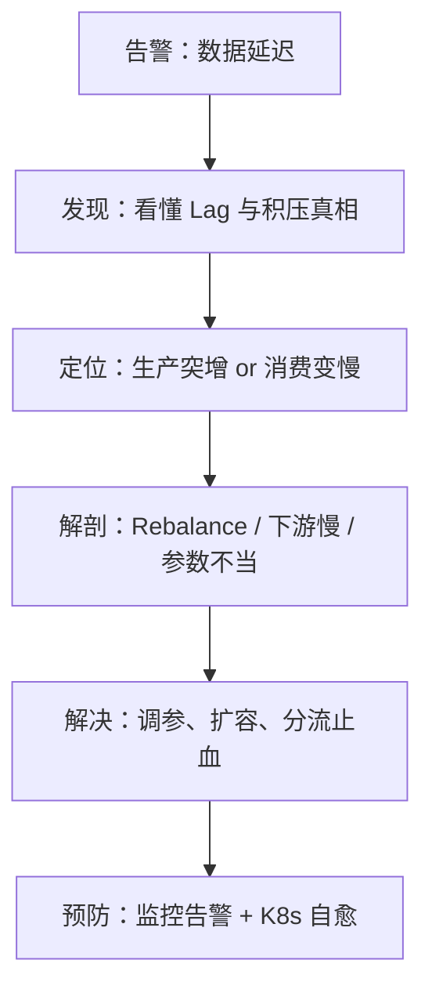
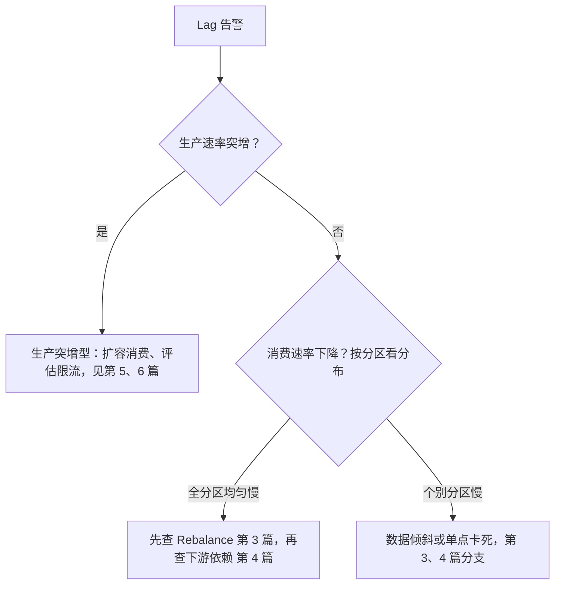

> Kafka 消费积压排查系列 · 第 2 篇。上一篇我们用 Docker 搭好环境、亲手制造了一次积压，看懂了 Lag 这个消费健康的唯一金标准（没看过的建议先读：[《Kafka 消费积压排查入门：Docker 搭环境亲手制造一次 "消息堵死"，10 分钟看懂 Lag》](https://nanoyeluo.github.io/2026/09/21/Kafka-%E6%B6%88%E8%B4%B9%E7%A7%AF%E5%8E%8B%E6%8E%92%E6%9F%A5%E5%85%A5%E9%97%A8%EF%BC%9ADocker-%E6%90%AD%E7%8E%AF%E5%A2%83%E4%BA%B2%E6%89%8B%E5%88%B6%E9%80%A0%E4%B8%80%E6%AC%A1-%E6%B6%88%E6%81%AF%E5%A0%B5%E6%AD%BB-%EF%BC%8C10-%E5%88%86%E9%92%9F%E7%9C%8B%E6%87%82-Lag/)）。但 Lag 只负责报警，回答不了"为什么堵"。这篇给一套三分钟分诊法：三个问题分清「生产突增」和「消费变慢」，外加没有监控面板时的纯手工取数姿势。
<!-- more -->

# 前言：那个熟悉的深夜

还是订单同步那个服务。周三晚上十一点，告警又来了：消费组 Lag 超过阈值。这一次你淡定了不少——第 1 篇的功夫没白练，你熟练地执行 `--describe`，12 个分区、总 Lag 98 万，实锤积压。

群里有人@你："重启下消费者试试？以前这么搞好的。"你的手指已经放在键盘上……

**停。**

```javascript
    重启能治本吗？如果重启完 Lag 接着涨呢？
    是消息突然变多了，还是消费突然变慢了？
    没有监控面板的话，命令行能算出"速率"吗？
```

上一篇我们走完了五步流程的第一步「发现」，本篇走第二步——**定位**：



本文的目标很实际：**读完之后，你能用三个问题在三分钟内给一次积压定性，并且能说清为什么"先重启"是最常见的错误动作**。

`环境说明：沿用第 1 篇的实验环境（kafka 容器、order-event topic、consumer.py 消费者），命令规范同第 1 篇——容器内执行或全路径 + Git Bash 双斜杠，不再重复展开。`

# 先立判据：积压只有两种成因

第 1 篇我们立过一个水池模型：**topic 是水池，生产是进水管，消费是出水管。积压的数学条件只有一个——进水速率 > 出水速率，且持续。**

现在是回收它的时候。进水和出水各自只有"正常"和"异常"两种状态，所以积压的成因谱系其实非常窄：

**成因 A：进水太快（生产突增）。** 线上的典型来源就这几种：

| 来源 | 典型场景 |
| --- | --- |
| 流量洪峰 | 大促零点、热点事件、推送全量下发 |
| 批量任务 | 定时 Job 一次性灌入百万条 |
| 重试风暴 | 上游超时后指数重试，同样的事件被反复发送 |
| CDC 快照 | Debezium initial snapshot 全量回放（本系列番外篇细聊） |

**成因 B：出水太慢（消费变慢）。** 嫌疑人有三个：Rebalance 风暴（第 3 篇解剖）、下游依赖慢（第 4 篇）、并发与参数不当（第 5 篇）。注意本篇的边界——**只分诊，不解剖**。分诊错了方向，后面解剖得再深也是白忙。

至于"先重启试试"，一句话点透：**重启消费者会触发整个消费组 Rebalance，所有分区重新分配、消费暂停，积压不降反升**（第 3 篇会把这个过程开膛破肚）；而且它对进水快、出水慢任何一边都治标不治本。重启不是排查动作，是祈祷动作。

# 三分钟分诊法：三个问题

这是本篇的核心交付物。三个问题按顺序问，每个问题都是同一个句式：**看什么指标、和什么比、得出什么结论**。

## Q1：生产速率突增了吗

看 topic 当前的写入速率（msg/s），**和平时基线比**。

注意"和基线比"这四个字——**没有基线就没有"突增"**。5000 msg/s 对大促零点是正常水位，对周三深夜就是洪水。基线从哪来：有监控就拉历史同时段曲线（kafka-ui 的 topic 页、Prometheus 的 messages-in 都可以）；没监控就问业务——今晚有大促吗？有批处理任务吗？上游发版了吗？

- 突增 → 成因 A，直接看决策矩阵；
- 平稳 → 进入 Q2。

## Q2：消费速率下降了吗

看消费组当前的消费速率，同样和基线比。你的消费者平时能跑 800 msg/s，现在只有 10 msg/s，那就是消费端出了问题。

先问一个更基础的子问题：**速率是"低"，还是"零"？** 如果采样出来 consume rate 恰好是 0，先别分析快慢——多半是消费者根本没在跑。确认方法：`--describe` 的输出里 CONSUMER-ID 和 HOST 列是空的（显示 `-`），或者加 `--members` 查不到任何成员、`--state` 显示 `Empty`，都说明组里没有在线消费者。这时候的处置不是排查而是救活：去看消费服务的进程 / Pod 为什么不在。这是线上最常见的事故形态——服务挂了两天没人发现，因为 Lag 告警恰好也没配（第 1 篇坑 1 的完整版）。

- 为零 → 消费者不在线，先救活服务；
- 跌破基线 → 成因 B，进入 Q3 确定解剖方向；
- 正常 → 回到 Q1 复查：多半是漏看了某个上游生产者（比如另一个团队的服务也在往这个 topic 写）。

## Q3：积压是全分区均匀，还是个别分区

回收第 1 篇的工程直觉：`--describe` 的 LAG 列按分区分列看。

- **12 个分区均匀积压** → 系统性问题：要么生产突增，要么消费整体变慢；
- **个别分区积压、其他分区正常** → 数据倾斜（某个 key 的消息打爆了一个分区）或单点卡死（某个消费者实例 hang 住了）——这两者的排查方向完全不同，千万别被总数平均掉。

## 决策矩阵

三个问题问完，对照这张表收拢结论：

| 生产速率 | 消费速率 | 分区分布 | 定性 | 去处 |
| --- | --- | --- | --- | --- |
| 任意 | 0（无在线成员） | —— | 消费者不在线 | 先救活消费服务：进程 / Pod / 注册状态 |
| 突增 | 正常（满负荷） | 均匀 | 生产突增型 | 扩容消费、评估限流（第 5、6 篇） |
| 平稳 | 跌破基线 | 均匀 | 消费整体变慢 | 先查 Rebalance（第 3 篇），再查下游（第 4 篇） |
| 平稳 | 跌破基线 | 个别分区 | 数据倾斜 / 单点卡死 | 第 3、4 篇对应分支 |
| 突增 | 下降 | 均匀 | 祸不单行：突增撞上变慢 | 先扩容止血，再解剖消费端 |

# 没有监控面板怎么办：两次采样法

生产排障时，监控面板可能恰好没权限、恰好没部署、恰好挂了。命令行纯手工估算速率，是人人都要会的保底技能。

原理一句话：**速率 = 位点差 ÷ 时间差**。所有速率指标的本质，都是采样两次、做个除法。

- **生产速率**：用 `kafka-get-offsets.sh` 查两次各分区的 LOG-END-OFFSET 求和，间隔 30 秒，差值 ÷ 30；
- **消费速率**：用 `--describe` 查两次各分区的 CURRENT-OFFSET 求和，同样差值 ÷ 30。

手工算太繁琐，直接上脚本。`docker exec -it kafka bash` 进容器，**把下面这段整体粘贴到终端直接执行**——它是几个函数定义加顺序执行，不需要保存成文件：

```bash
K=/opt/kafka/bin
B="--bootstrap-server localhost:9092"

read_end() { $K/kafka-get-offsets.sh $B --topic order-event | awk -F: '{s+=$3} END {print s}'; }
read_cur() { $K/kafka-consumer-groups.sh $B --describe --group order-consumer 2>/dev/null | awk 'NR>1 {s+=$4} END {print s}'; }

e1=$(read_end); c1=$(read_cur)
sleep 30
e2=$(read_end); c2=$(read_cur)

echo "produce rate: $(( (e2-e1)/30 )) msg/s"
echo "consume rate: $(( (c2-c1)/30 )) msg/s"
echo "backlog rate: $(( (e2-e1-c2+c1)/30 )) msg/s  # >0 = still piling up"
```

`read_end` 把 12 个分区的末尾位点加总（生产总量），`read_cur` 把 12 个分区的已提交位点加总（消费总量），30 秒前后各采一次，除法出速率。最后一行 backlog rate（净积压速度）是赠品：它大于 0，说明水池还在涨水；小于 0，说明在退水。

顺带提醒一个容器权限差异点：`apache/kafka` 镜像默认以**非 root 用户**运行，`/opt/kafka` 等目录都是只读的。如果习惯用 vi 把脚本存成文件再执行，存盘会报权限不足——想落盘就写到 `/tmp`，或者在宿主机写好再 `docker cp` 进去。对这种一次性采样脚本，整段粘贴执行是最省事的。另外这个最小化镜像的 locale 不含中文字符集，终端里中文会显示成乱码，所以脚本输出全部用英文。

一个注意事项：**采样窗口取 30~60 秒，别太短**。第 1 篇讲过消费端位点是阶梯式提交的，窗口太短会被这种跳动感干扰，算出离谱的速率。

# 实验复现：亲手制造两种积压

光说不练假把式。沿用第 1 篇的环境，同一个 topic、同一个消费组，我们先后制造两种成因的积压，亲眼看体征差异。（以下速率数字是我们环境的实测，你的环境绝对值会不同——**关注相对关系，不关注绝对值**。）

## 实验 A：生产突增型积压

消费者恢复健康——把 `consumer.py` 里的 `time.sleep(0.1)` 改成 `pass`（注意是**改**不是删：Python 的 for 循环体不能为空，只删会收获一个 `IndentationError`），全速消费。

"突增"是相对消费能力而言的，所以**第一步不是灌，而是先摸清这台消费者的满负荷容量**。先用一个中规中矩的速率灌着（throughput 5000），灌的同时跑一遍两次采样脚本：

```bash
docker exec kafka /opt/kafka/bin/kafka-producer-perf-test.sh \
  --topic order-event \
  --num-records 1000000 \
  --record-size 1024 \
  --throughput 5000 \
  --producer-props bootstrap.servers=localhost:9092
```

```plain
produce rate: 5403 msg/s
consume rate: 7361 msg/s
backlog rate: -1958 msg/s  # >0 = still piling up
```


意外发生了：**consume rate 比 produce rate 还高，backlog rate 是负数**——积压不升反降。5000 msg/s 对这台满血消费者（Python 客户端都能跑到 7300+）来说根本不是洪峰，人家边吃边把存量往下消。这正好印证了 Q1 的那句话：没有基线就没有"突增"。

那就加压力到容量的近三倍，`--throughput 20000` 再来一次：

```bash
docker exec kafka /opt/kafka/bin/kafka-producer-perf-test.sh \
  --topic order-event \
  --num-records 1000000 \
  --record-size 1024 \
  --throughput 20000 \
  --producer-props bootstrap.servers=localhost:9092
```

```plain
produce rate: 21647 msg/s
consume rate: 6252 msg/s
backlog rate: +15394 msg/s  # >0 = still piling up

```

体征记录：**Lag 持续上涨，但消费速率正常**——消费者被钉在满负荷上，它没有病，是水进得太猛。细心的读者会发现一个细节：consume rate 比空载实测的 7361 还低了一截——broker 在 2 万 msg/s 的高压下自己也在满负荷转，消费端能抢到的配额自然变少。这也是真实线上的常态：**高压之下，生产和消费是互相抢资源的**。



## 实验 B：消费变慢型积压

先清场。最干净的方式是停掉消费者、删 topic 重建：

```bash
# 先 Ctrl+C 停掉 consumer.py，再执行
docker exec kafka /opt/kafka/bin/kafka-topics.sh \
  --bootstrap-server localhost:9092 --delete --topic order-event
docker exec kafka /opt/kafka/bin/kafka-topics.sh --create \
  --bootstrap-server localhost:9092 --topic order-event \
  --partitions 12 --replication-factor 1
```

注意一个容易想当然的坑：**别拿 `kafka-consumer-groups.sh --delete-offsets` 当清场手段**。它只删消费位点、不删消息，而且要求消费组内没有在线成员（不停消费者直接执行会被拒）；删完用 `earliest` 重启，消费者会把实验 A 灌进去的上百万条存量全部重追一遍——那不是实验 B 想要的干净现场，倒恰好是第 1 篇坑 2 的"假积压"实景。这个命令的真实用途是"让消费组重追数据"，不是清空现场。

清场完毕，这次反过来：生产恢复平稳，模拟平时 50 msg/s 的业务流量：

```bash
docker exec kafka /opt/kafka/bin/kafka-producer-perf-test.sh \
  --topic order-event \
  --num-records 100000 \
  --record-size 1024 \
  --throughput 50 \
  --producer-props bootstrap.servers=localhost:9092
```

同时消费者埋回那颗雷——`time.sleep(0.1)`，消费速率掉到 10 msg/s。再跑采样脚本：

```plain
produce rate: 53 msg/s
consume rate: 10 msg/s
backlog rate: +43 msg/s  # >0 = still piling up

```

体征记录：**Lag 持续上涨，生产速率完全正常，是消费速率跌破了基线**。



## 对照表：两种成因的体征

| 体征 | A：生产突增 | B：消费变慢 |
| --- | --- | --- |
| Lag 曲线 | 持续爬升 | 持续爬升（一模一样） |
| 生产速率 | 远超基线 | 正常 |
| 消费速率 | 正常（满负荷） | 跌破基线 |
| 正确处置 | 扩容消费 / 评估限流 | 揪慢的根因，重启无用 |

把两个实验的 Lag 曲线摆在一起，你会发现它们长得一模一样——**Lag 只负责报警，定性必须看速率**。这就是第 1 篇那句"Lag 回答不了为什么堵"的实验证据。

# 一张决策树收拢全篇

把三分钟分诊法画成决策树，这也是全系列的导航图：



这张图会随系列推进不断填实：第 3、4 篇把"消费变慢"的两个分支各自解剖透，第 5 篇给扩容调优的正确姿势，第 6 篇收官时它会变成一份完整的排查 Checklist。

# 三个必踩的坑

## 坑 1：重启消费者是最常见的错误动作

回到前言那个场景："重启试试，以前这么搞好的。"——以前好的那次，大概率是消费者恰好 hang 死了（个例），重启相当于误打误撞。但作为通用动作，重启的收益是负的：

- 消费者离组会触发**全组 Rebalance**：所有分区重新分配，分配期间整个消费组停工，积压继续涨；
- 如果你的服务跑在 K8s 里，Rebalance 期间心跳异常还可能被探针判定为不健康、再次拉起——于是一边积压一边反复重启，形成持续的 Rebalance 风暴。

这就是第 3 篇的主线剧情，到时候我们会亲手把这个风暴制造出来。

## 坑 2：用 Lag 绝对值做告警，天天误报

很多团队的告警规则是"Lag > 100000 就报警"，然后大促期间告警群被打爆——100 万 Lag 听着吓人，但消费速率 2000 msg/s 时 8 分钟就追平了，根本不用人管；反过来，一个 10 msg/s 的低频 topic 积了 1 万条，要追 16 分钟，反而没人发现。

回收第 1 篇的公式：**告警应该打在「预计消化时长 = Lag ÷ 消费速率」上，而不是条数上**。条数是体量，消化时长才是体感。具体怎么落地到 Prometheus 告警规则，第 6 篇展开。

## 坑 3：只看总 Lag，漏掉数据倾斜

同样是 12 万总 Lag：12 个分区各积 1 万，是"全员吃不动"的系统性问题；1 个分区积 12 万、其余正常，是某个 key 打爆了单个分区——前者要扩容，后者要查 key 的设计（比如所有消息都用了同一个用户 ID 做 key）。**看板、告警、巡检，全部要落到分区维度**，总数会撒谎。

## 小结

到目前为止，我们掌握了积压排查的第二个标准动作——分诊：

```javascript
三分钟分诊：看生产速率（vs 基线） → 看消费速率（vs 基线） → 看分区分布（均匀 or 个别）
没有监控面板：两次采样法，速率 = 位点差 ÷ 时间差，窗口 30 秒
```

我们还亲手制造了两种成因的积压，验证了"Lag 曲线一模一样，定性必须看速率"，并且说清了为什么不能先重启。

分诊到这里只剩最后一个分支没展开：**消费变慢、且全分区均匀**。先别急着怀疑下游——有一种积压形态最诡异：消费者进程活着、日志没报错，却集体不干活，Lag 曲线呈诡异的锯齿状。下一篇《消费者明明在线却不干活？一次 Rebalance 风暴的解剖报告》，我们把消费组内部开膛看看。