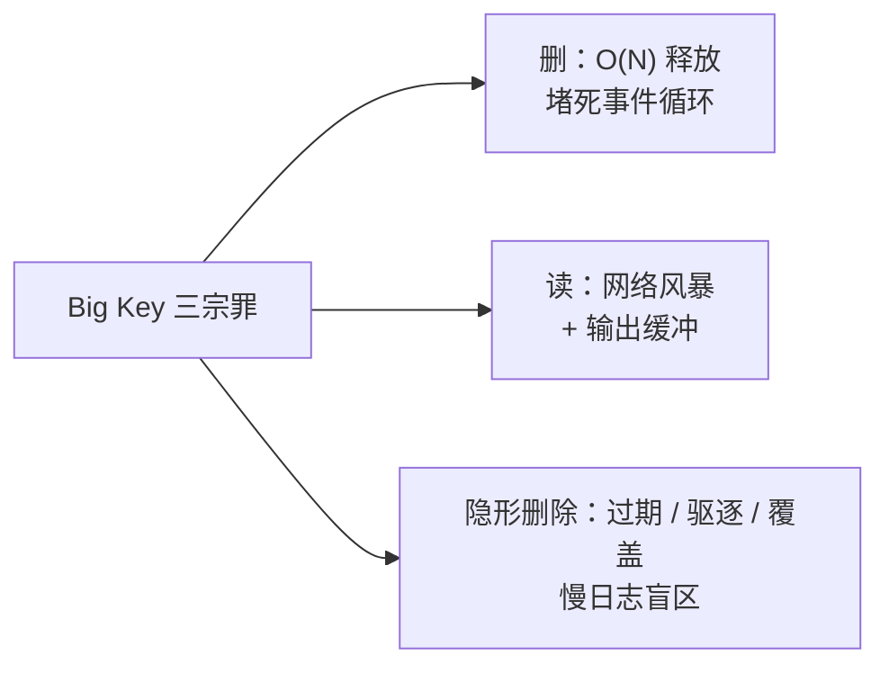

> Redis Big Key 系列 · 第 3 篇。上一篇我们用三板斧扫出了《清除优先级清单》，10 颗炸弹一个不落（没看过的建议先读：[《几十万个 key 扫不过来？--bigkeys、SCAN、RDB 离线分析三步定位最该清的 Big Key》](https://nanoyeluo.github.io/2026/09/18/%E5%87%A0%E5%8D%81%E4%B8%87%E4%B8%AA-key-%E6%89%AB%E4%B8%8D%E8%BF%87%E6%9D%A5%EF%BC%9F-bigkeys%E3%80%81SCAN%E3%80%81RDB-%E7%A6%BB%E7%BA%BF%E5%88%86%E6%9E%90%E4%B8%89%E6%AD%A5%E5%AE%9A%E4%BD%8D%E6%9C%80%E8%AF%A5%E6%B8%85%E7%9A%84-Big-Key/)）。但清单只回答了"多大"，回答不了"为什么危险"。这篇把清单上的代表请上解剖台。
<!-- more -->

# 前言：清单到手，该动刀了

回顾上篇的清单，两个极端很有意思：

| 排名 | key | 类型 | 规模 | 预估 DEL 耗时 | 优先级 |
| --- | --- | --- | --- | --- | --- |
| 2 | user:profile:10086 | Hash | 100 万 field | ~0.11s | P0 |
| 6 | product:detail:1001 | String | 2MB | 微秒级 | P3 |

一个疑问顺理成章：**100 万 field 的 Hash 占 61MB，2MB 的 String 占 2.5MB——体量差 25 倍，删除耗时却差了五个数量级；而优先级上，删除"微秒级"的 String 居然还排得上号**。清单上的数字回答不了这些，要解剖。

本篇解剖对象就这两位：P0 的 `user:profile:10086`（删除阻塞代表）和 P3 的 `product:detail:1001`（读放大代表）——一个"删着卡"，一个"读着卡"。解剖路线：



关于标题里的"1 秒"圆个场：实验环境删 100 万 field 实测 0.11 秒（第 1 篇的机器不错），线上老机器、500 万 field 的 Hash，一删就是秒级——数字随环境浮动，机理一模一样。环境沿用上两篇（Docker + Redis 8.2，容器 `redis8`），所有命令可直接复制复现。

# 解剖一：删除为什么卡——单线程 + O(N) 释放

## 事件循环：一个萝卜蹲，全员看戏

Redis 的主线程是一个事件循环，伪代码就三行：

```plain
while (true) {
    取出下一个就绪的命令
    执行它          <-- 此刻全宇宙都在等
    把结果写回客户端
}
```

"单线程"三个字平时是美德（无锁、快），遇到 Big Key 就成了诅咒：**任何一个命令慢了，后面所有命令排队**。第 1 篇实测过：DEL 一颗 100 万 field 的 Hash，服务端耗时 0.11 秒——这 0.11 秒里，整个 Redis 对世界暂停服务。

## DEL 的 0.11 秒花在哪儿

Hash 的底层是哈希表，DEL 要做的事：遍历表里 100 万个 entry，逐个释放 field 的内存、value 的内存、entry 本身的内存，最后释放桶数组。**100 万次 free，一次都省不了**——这就是 O(N)。而 String 的 DEL 只释放一块连续内存，O(1)，所以 2MB 也是微秒级。

## 实测矩阵：DEL 耗时阶梯（速查表 1）

别凭感觉，造四颗不同规格的试验 Hash，逐个删一遍。吸取第 1 篇的教训——Windows 下 `time docker exec` 测的全是启动开销，这次直接**把慢日志阈值调成 0，让 Redis 自己汇报**：

```bash
# 1. 造四颗试验 Hash：1 万 / 10 万 / 50 万 / 100 万 field
for n in 10000 100000 500000 1000000; do python -c "for i in range($n): print(f'HSET tmp:bench:$n f:{i} v:{i}')" | docker exec -i redis8 redis-cli --pipe > /dev/null; done

# 2. 慢日志阈值调成 0：记录所有命令（实验环境专用姿势，线上别这么干）
docker exec -i redis8 redis-cli CONFIG SET slowlog-log-slower-than 0

# 3. 逐个删除
for n in 10000 100000 500000 1000000; do docker exec -i redis8 redis-cli DEL tmp:bench:$n; done

# 4. 看案底
docker exec -i redis8 redis-cli SLOWLOG GET 4

# 5. 恢复默认阈值 10ms
docker exec -i redis8 redis-cli CONFIG SET slowlog-log-slower-than 10000
```



四条案底的耗时字段（微秒）：

```plain
4) ... 111954  DEL tmp:bench:1000000    -- 100 万 field：112ms
3) ...  40367  DEL tmp:bench:500000     -- 50 万 field：40ms
2) ...   4646  DEL tmp:bench:100000     -- 10 万 field：4.6ms
1) ...    512  DEL tmp:bench:10000      -- 1 万 field：0.5ms
```

整理成速查表：

**速查表 1：DEL 耗时阶梯（实测）**

| field 数 | DEL 服务端耗时 | 默认慢日志（10ms 阈值）留痕？ |
| --- | --- | --- |
| 1 万 | ~0.5ms | 不留 |
| 10 万 | ~4.6ms | **不留** |
| 50 万 | ~40ms | 留 |
| 100 万 | ~112ms | 留 |

两个结论：

1. **耗时跟着元素个数走，近似线性、顶部略翘**——1 万→10 万，数据 10 倍、耗时 9 倍；50 万→100 万，数据 2 倍、耗时 2.8 倍。顶部那一点超线性，是哈希表扩容档位的抖动，第 2 篇讲 Hash"同规格不同体重"时见过它。另外 100 万档的 112ms 和第 1 篇 `tmp:big:hash` 的 111ms 几乎分毫不差——两次独立测量对上了，这张表可以放心引用；
2. **10 万 field 是个隐形的档位**：实测 4.6ms，连 10ms 的慢日志阈值都够不着——删了也不留案底。第 2 篇清单里那五颗 P2 中号炸弹（`user:profile:10088`~`10092`）正是这个规格：它们每次被删，都悄无声息地卡主线程 5 毫秒，监控上一片岁月静好。量的积累就是质的突变——一天删几千次，P99 就被这样一点点啃掉了。

# 解剖二：读大 key 为什么卡——网络风暴与输出缓冲

删除维度说完，轮到读维度。解剖对象换成 P3 的 `product:detail:1001` 和 P0 的 `user:profile:10086`。

## HGETALL 实测：把 30MB 搬上网卡

对 100 万 field 的 Hash 来一次 HGETALL：

```bash
time docker exec -i redis8 redis-cli HGETALL user:profile:10086 > /dev/null
# real    0m0.847s
# user    0m0.031s
# sys     0m0.061s
```



掐表 0.847 秒。拆解一下：第 1 篇就认识的老熟人——Windows 下 `docker exec` 启动开销 ~0.3s——先扣掉，剩下 **0.5 秒多是实打实的"读 + 传 + 收"**。100 万个 field/value 对，序列化成 RESP 协议报文约 30MB，从 Redis 进程搬进内核缓冲区、再上网卡、再到客户端——**命令本身的"执行"是微秒级，慢全慢在传输上**。注意这还是本地 Docker 网桥，物理网卡都没出；生产上跨机房走真实网络，30MB 的响应包只会更慢。这也是为什么慢日志里 HGETALL 的耗时数字往往不难看（[坑 1](#keng-1-slowlog) 细说）。 
再看服务端视角：执行期间用 `CLIENT LIST` 观察这个连接的 `omem`（输出缓冲占用），正常连接是几 KB，HGETALL 进行中会涨到几十 MB。普通客户端的输出缓冲默认不限制（`client-output-buffer-limit normal 0 0 0`），缓冲可以无限涨——**几个并发的大 HGETALL，内存就这样被"读"爆**。

## 带宽算账：速查表 2

String 那颗 2MB 的 `product:detail:1001`，危害量化一下：

**速查表 2：单次读取大小 × QPS = 出口带宽**

| 单次读取 | QPS | 出口带宽 | 网卡处境 |
| --- | --- | --- | --- |
| 2MB | 60 | ~120MB/s | **千兆网卡打满** |
| 2MB | 600 | ~1.2GB/s | 万兆也吃紧 |
| 10KB | 10000 | ~100MB/s | 高频"小 key"同样能打死千兆 |

两个反直觉的结论：

1. **2MB 的 key 不需要多少 QPS**——每秒 60 次 GET 就把千兆网卡打满，同机其他 Redis 流量一起陪葬；
2. **"小" key 也不无辜**——10KB 配 1 万 QPS 一样是 100MB/s。这就是第 1 篇说的"阈值和访问频率挂钩"的量化版本，也正式还了第 2 篇的账：P3 的危害在读，不在删。

# 解剖三：隐形删除——不敲 DEL 也会卡

最阴的一种：你没敲 DEL，Redis 自己把大 key 删了，主线程照样卡住，你还查不到。隐形删除有三位：

## 覆盖写：最日常的隐形 DEL

`SET` 一个已存在的 key，旧值要被释放——**SET 覆盖 = 隐式 DEL**。实测（继续用阈值 0 的慢日志拿服务端耗时）：

```bash
# 造一颗 100 万 field 的 Hash
python -c "for i in range(1000000): print(f'HSET tmp:cover f:{i} v:{i}')" | docker exec -i redis8 redis-cli --pipe > /dev/null

docker exec -i redis8 redis-cli CONFIG SET slowlog-log-slower-than 0

# 用一个小 String 覆盖它
docker exec -i redis8 redis-cli SET tmp:cover "tiny"

docker exec -i redis8 redis-cli SLOWLOG GET 1
# 耗时字段：~110000 微秒 —— SET 一个小值，花了 0.11 秒

docker exec -i redis8 redis-cli CONFIG SET slowlog-log-slower-than 10000
```



SET 一个小 String 本该是微秒级，这里却花了 0.103 秒——**时间全花在隐式释放那颗 100 万 field 的旧 Hash 上**。对个账：速查表 1 里 DEL 同规格 Hash 是 111954µs，这次 SET 是 102852µs，几乎分毫不差——"SET 覆盖 = 隐式 DEL"不是修辞，是字面事实，连账单金额都一样。`RENAME` 覆盖已有 key 同理。管辖开关 `lazyfree-lazy-server-del`，默认 **no**（同步删）。

## 过期与驱逐：慢日志查无此人

- **过期删除**：key 到期被清掉。好消息——`lazyfree-lazy-expire` 从 4.0 起默认 **yes**，过期删除默认异步释放，相对安全；
- **驱逐**：内存打满触发 maxmemory 策略，逐到大 key 时主线程同步卡——`lazyfree-lazy-eviction` 默认 **no**。而且驱逐是内部操作，**不是客户端命令，慢日志里查无此人**，是生产上最难归因的尖刺来源之一。

**速查表 3：lazyfree 开关矩阵**（`CONFIG GET lazyfree-lazy-*` 自查）：

| 开关 | 默认值 | 管辖场景 |
| --- | --- | --- |
| `lazyfree-lazy-expire` | **yes** | 过期 key 的删除 |
| `lazyfree-lazy-eviction` | no | maxmemory 驱逐时的删除 |
| `lazyfree-lazy-server-del` | no | 覆盖写 / RENAME 等隐式删除 |
| `lazyfree-lazy-user-del` | no | 用户显式 DEL 是否自动变 UNLINK |
| `lazyfree-lazy-user-flush` | no | FLUSHALL / FLUSHDB 是否异步 |

注意默认值不统一——不是"全开"也不是"全关"，[坑 3](#坑-3：lazyfree-默认值别背口诀) 细说。`lazyfree-lazy-user-del` 是下篇的主角之一，这里先混个脸熟。

# 加菜：Cluster 下的数据倾斜

如果上 Cluster，Big Key 还多个罪名：**数据倾斜**。集群按 `crc16(key) mod 16384` 分槽，一颗 key 再大也只压一个 slot、一个节点——87MB 的 `rank:global` 落在哪里，哪个节点就内存偏高、流量偏高，其他节点闲得发慌，扩容也救不了单点。

监控姿势：`--bigkeys` 或第 2 篇的 SCAN 脚本**对每个节点分别跑一遍**（`redis-cli -h node1 --bigkeys`），别只看集群汇总视图。

# 三个必踩的坑

## 坑 1：SLOWLOG 抓不到"读大 key"的慢

慢日志统计的是命令的**执行**耗时——把响应写进输出缓冲就计完，30MB 上网卡、到客户端的时间不算。所以 HGETALL 大 Hash 在慢日志里可能只有几毫秒，用户端却卡了近一秒。**网络维度的慢，盯带宽和 `omem`，别在慢日志里空等**。

## 坑 2：别拿 MB 估算 DEL 阻塞时间

速查表 1 的线性关系摆在那儿：DEL 耗时跟**元素个数**走，跟**字节数**无关。2MB 的 String 微秒级，61MB 的 Hash 0.11 秒。评估一颗 key 的删除风险，第一眼看类型和元素个数，不看体积。

## 坑 3：lazyfree 默认值别背口诀

五个 `lazyfree-lazy-*` 开关默认值不统一（expire 默认 yes，其余默认 no），不同版本还可能有调整。别背"默认全开/全关"，两个动作最靠谱：`CONFIG GET lazyfree-lazy-*` 查自己的版本；重要变更前翻官方文档确认。

# 小结

三宗罪，一句话各收一条：

- **删**：集合删除是 O(N) 的逐个 free，主线程全程不放手，耗时和元素个数线性相关（速查表 1）；
- **读**：大 value 的慢在传输不在执行——带宽算账（速查表 2）+ 输出缓冲 `omem` 膨胀；
- **隐形删除**：覆盖写、过期、驱逐都会隐式释放大 key，驱逐连慢日志都不进；lazyfree 开关矩阵（速查表 3）逐个核对。

病因清楚了，该排雷了：DEL 不能用，`UNLINK` 凭什么能救？100 万 field 的 Hash 怎么分批安全删除？业务侧的大 key 怎么拆？下一篇收官：《Big Key 清除的最后一步：UNLINK、分批删除与 Key 拆分实战（Redis 8.2）》。
