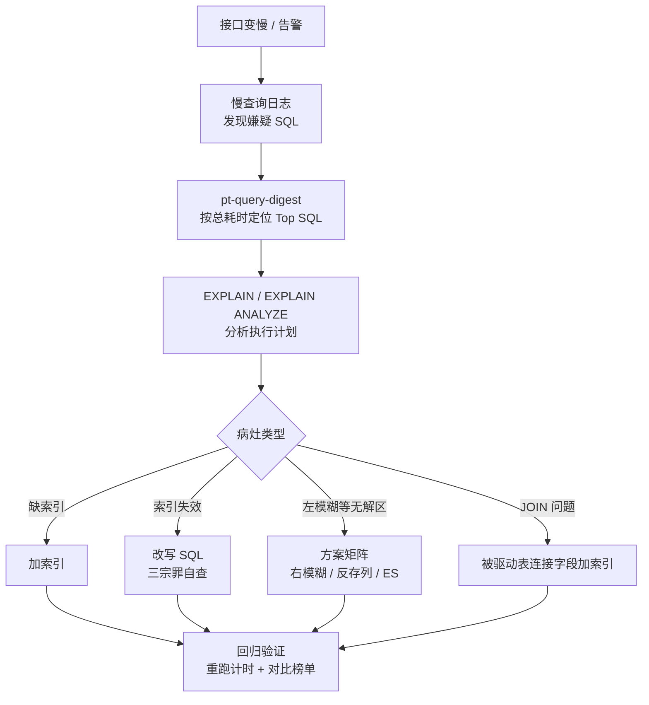

---

> 慢查询系列 · 第 4 篇（收官）。上一篇我们用 EXPLAIN 解剖了左模糊，顺手修掉了榜单上的三条慢 SQL（没看过的建议先读：[《读懂 EXPLAIN：一条慢 SQL 的解剖报告》](https://nanoyeluo.github.io/2026/09/14/%E8%AF%BB%E6%87%82-EXPLAIN%EF%BC%9A%E4%B8%80%E6%9D%A1%E6%85%A2-SQL-%E7%9A%84%E8%A7%A3%E5%89%96%E6%8A%A5%E5%91%8A%EF%BC%88%E9%99%84-type-key-Extra-%E9%80%9F%E6%9F%A5%E8%A1%A8%EF%BC%89/)）。榜单还剩最后一条——22.6 秒的 JOIN。这篇解剖它、修复它，然后把全系列沉淀成一套可复用的方法论。
<!--more-->

## 前言：最后一条慢 SQL

回顾上一篇结尾的战况：

| 排名 | SQL | 状态 |
| --- | --- | --- |
| 1 | D：`city = '北京' LIMIT 100` | ✅ 已修（idx_city） |
| 2 | C：orders JOIN user | ⬜ **本篇目标** |
| 3 | B：`name LIKE '%34567'` | ✅ 方案已定（右模糊 / ES，业务拍板） |
| 4 | A：`phone = '13800001111'` | ✅ 已修（idx_phone） |

C 是条硬骨头：单次 22.6 秒，一天 5 次，JOIN 两张表扫了 900 多万行。本篇两件事：

1. 解剖并修复 C——JOIN 的索引原理和单表不一样，MySQL 8.0 还换了 hash join 新引擎；
2. 收官——联合索引、覆盖索引、索引失效三宗罪，外加全系列的方法论总结。

环境沿用前三篇（Docker + MySQL 8.0.43，容器 `mysql8new`，库 `mydb`，`user` 表 1000 万行、`orders` 表 500 万行），所有命令可直接复制复现。

## 解剖 C：JOIN 的 EXPLAIN 是「两行口供」

C 的完整 SQL（从第二篇报告的 sample query 里抄的）：

```sql
SELECT * FROM orders o JOIN user u ON o.user_id = u.id WHERE u.phone = '13800001111';
```

EXPLAIN 它：

```sql
EXPLAIN SELECT * FROM orders o JOIN user u ON o.user_id = u.id WHERE u.phone = '13800001111'\G
```

```javascript
*************************** 1. row ***************************
           id: 1
  select_type: SIMPLE
        table: u
   partitions: NULL
         type: ref
possible_keys: PRIMARY,idx_phone
          key: idx_phone
      key_len: 82
          ref: const
         rows: 1
     filtered: 100.00
        Extra: NULL
*************************** 2. row ***************************
           id: 1
  select_type: SIMPLE
        table: o
   partitions: NULL
         type: ALL
possible_keys: NULL
          key: NULL
      key_len: NULL
          ref: NULL
         rows: 4985343
     filtered: 10.00
        Extra: Using where; Using join buffer (hash join)
```
 

单表查询的 EXPLAIN 只有一行，**JOIN 是每张表一行「口供」：上面的是驱动表，下面的是被驱动表**。逐行读：

- **第 1 行（u，驱动表）**：type=ref，走 idx_phone，rows=1——优化器打算先用 phone 索引定位到那 1 个用户。注意一个细节：第二篇第一次跑 C 时 user 还没有任何索引，当时**两行都是 ALL**；第三篇给 user 加了 idx_phone 后，优化器立刻把 user 挑成了驱动表。优化器的选择标准永远一样：**谁过滤后行数少，谁驱动**。
- **第 2 行（o，被驱动表）**：type=ALL，rows≈498 万，Extra 里两个关键词——`Using where`（扫出来再过滤）和 `Using join buffer (hash join)`（连接字段没索引，用 hash join 兜底）。病灶就在这：**orders.user_id 上没有索引**。

再用 EXPLAIN ANALYZE 看实况（会真实执行）：

```javascript
-> Inner hash join (o.user_id = u.id)  (cost=513613 rows=498534) (actual time=812..812 rows=0 loops=1)
    -> Table scan on o  (cost=64931 rows=4.99e+6) (actual time=0.472..623 rows=5e+6 loops=1)
    -> Hash
        -> Index lookup on u using idx_phone (phone='13800001111')  (cost=1.1 rows=1) (actual time=0.0653..0.0668 rows=1 loops=1)
```

 

从里往外读这棵执行树：

- 最里层 `Index lookup on u`：idx_phone 定位 1 行，0.07 毫秒；
- `Hash`：把这 1 行构建成 hash 表（build 侧）；
- `Table scan on o`：orders 全表扫 500 万行（623 毫秒），逐行去 hash 表里匹配（probe 侧）；
- 顶层 join 输出 0 行——这个 user 恰好一单都没有。全程 812 毫秒。

等等——第二篇测的可是 **22.6 秒**，怎么现在只剩 0.8 秒？因为第三篇给 user 加了 idx_phone！第二篇时 user 也没索引，执行计划是「user 全表扫 1000 万行过滤 phone，再和 orders 做 hash join」；现在驱动表变成索引定位 1 行，hash 表的 build 侧从「扫 1000 万行」变成「1 次索引查找」。**一条索引救了两条 SQL**——A 和 C 都吃了 idx_phone 的红利。

但别高兴太早：812 毫秒里 623 毫秒花在 orders 全表扫 500 万行做 probe 上——**被驱动表没索引的尾巴还在**，这才是本篇要补的最后一刀。

## JOIN 原理 5 分钟：嵌套循环与 hash join

为什么 orders.user_id 没索引就要扫 500 万行？看 JOIN 的执行本质。

**嵌套循环（Nested-Loop Join）**，最经典的 JOIN 算法，本质就是两层 for：

```
for 驱动表的每一行 {
    去被驱动表里找匹配的行
}
```

如果被驱动表的连接字段**有索引**，内层循环是「索引定位」，一次几微秒；如果**没索引**，内层循环就是「全表扫描」——驱动表每出一行，被驱动表全表扫一遍。我们这个案例驱动表只有 1 行，还算运气好的；如果驱动表过滤后剩 10 万行，就是 10 万次全表扫描，跑到天荒地老。

**MySQL 的演进**：

- **8.0.18 之前**：没索引时用 Block Nested Loop（BNL）——把驱动表多行攒进 join buffer，凑一批再扫一次被驱动表，减少扫描次数。从「灾难」变成「比较灾难」。
- **8.0.18 起**：引入 **hash join**——把小结果集建成 hash 表（build），大表只扫一遍做匹配（probe），复杂度从 O(N×M) 降到 O(N+M)。8.0.20 起 BNL 正式移除，hash join 全面接管，就是我们 EXPLAIN 里看到的 `Using join buffer (hash join)`。

但别误会：**hash join 是兜底，不是方案**。它让「没索引的 JOIN」从「扫 N 遍大表」变成「扫 1 遍大表」——可 500 万行扫一遍也要 600 多毫秒。和「索引直接定位」比，依然差着几个数量级。

## 修复 C：最后一刀，0.8 秒 → 毫秒

病灶明确，药方就一行：

```sql
ALTER TABLE orders ADD INDEX idx_user_id(user_id);
```

修复后的 EXPLAIN（第 2 行的变化）：

```javascript
           id: 1
  select_type: SIMPLE
        table: o
   partitions: NULL
         type: ref
possible_keys: idx_user_id
          key: idx_user_id
      key_len: 8
          ref: mydb.u.id
         rows: 2
     filtered: 100.00
        Extra: NULL
```

 

type 从 ALL 变 ref，key_len=8（bigint 的长度），ref=mydb.u.id——**被驱动表的连接字段走了索引，驱动表每出 1 行，索引直接定位**。再看 EXPLAIN ANALYZE 的实况对比：

```javascript
-- 修复前：hash join，orders 全表扫 500 万行做 probe，812 毫秒
-- 修复后：
-> Nested loop inner join  (cost=3.33 rows=2.07) (actual time=1.39..1.39 rows=0 loops=1)
    -> Index lookup on u using idx_phone (phone='13800001111')  (cost=1.1 rows=1) (actual time=1.22..1.22 rows=1 loops=1)
    -> Index lookup on o using idx_user_id (user_id=u.id)  (cost=2.23 rows=2.07) (actual time=0.17..0.17 rows=0 loops=1)
```
 

执行引擎从 hash join 换回了嵌套循环——因为现在有索引了，嵌套循环的内层是「索引定位」：user 查找 1.22 毫秒，orders 查找 0.17 毫秒，全程 1.4 毫秒，比扫一遍大表快几百倍。

这条 SQL 的三次变身，正好是全系列的缩影：

| 阶段 | 耗时 | 发生了什么 |
| --- | --- | --- |
| 第二篇 | 22.6s | 两张表都没索引，user 全表扫 + hash join |
| 第三篇 | 0.8s | idx_phone 让驱动表变成索引定位（顺手吃的红利） |
| 本篇 | 1.4ms | idx_user_id 补上被驱动表的索引，回到嵌套循环 |

**算总账**：昨天 804 秒的慢查询总耗时，A、C、D 三条索引修复，B 方案已定——榜单四条全部处理完毕，全系列案例闭环。

## 联合索引：最左前缀与 key_len 量长度

C 修完了，但需求会升级。运营提出新查询：「查某用户某状态的订单」：

```sql
SELECT * FROM orders WHERE user_id = 100 AND status = 1;
```

现在 orders 上只有 idx_user_id，EXPLAIN 一下：

```javascript
         type: ref
          key: idx_user_id
      key_len: 8
         rows: 1
        Extra: Using where
```

`Using where` 说明：索引只定位了 user_id，status 是回表拿到整行后再过滤的。这个查询如果一天跑几十万次，值得给它建联合索引：

```sql
ALTER TABLE orders ADD INDEX idx_user_status (user_id, status);
```


再 EXPLAIN 同一条 SQL——咦，出意外了：

```javascript
         type: ref
possible_keys: idx_user_id,idx_user_status
          key: idx_user_id
      key_len: 8
         rows: 1
     filtered: 10.00
        Extra: Using where
```
 

possible_keys 里两个索引都在，优化器却**选了老的 idx_user_id，key_len 还是 8**。为什么？因为 `user_id = 100` 是等值查询，两个索引估算的 rows 都是 1，代价一模一样——优化器没有动力选更长的那个（短索引体积还小一点）。

这正是引出「冗余索引」的好机会：**idx_user_id 其实是多余的**——(user_id, status) 的最左列就是 user_id，任何能用 idx_user_id 的查询都能走联合索引的最左前缀（包括刚修好的 C）。留着它，白白吃写放大。删掉：

```sql
ALTER TABLE orders DROP INDEX idx_user_id;
```

再 EXPLAIN：

```javascript
         type: ref
          key: idx_user_status
      key_len: 9
        Extra: Using where
```
 

**key_len 终于从 8 变成 9**——第三篇说过 key_len 能「量长度」，这里兑现：user_id 是 bigint 占 8 字节，status 是 tinyint 占 1 字节，key_len=9 证明**两列都参与了索引定位**，不是只用到第一列。

顺便记住这条原则：**(A) 能被 (A, B) 完全替代，建联合索引时把冗余的单列索引删掉**——这也呼应了[坑 1](#坑-1：索引不是越多越好)。

### 最左前缀三条规则

联合索引 `(user_id, status)` 的用法边界，三条规则覆盖 95% 的场景：

| 规则 | 示例 | key_len | 解读 |
| --- | --- | --- | --- |
| 全列匹配 | `user_id = 100 AND status = 1` | 9 | 两列都用上，最佳 |
| 最左前缀 | `user_id = 100` | 8 | 只用第一列，正常 |
| 范围之后失效 | `user_id BETWEEN 100 AND 200 AND status = 1` | 8 | user_id 是范围，status 用不上 |

第三条我实测时先翻了一次车，值得展开。最初写的范围是 `user_id > 100`：

```javascript
         type: ALL
possible_keys: idx_user_status
          key: NULL
         rows: 4985343
        Extra: Using where
```

possible_keys 里明明有 idx_user_status，优化器却直接全表扫描——因为 user_id 取值到 1000 万，`> 100` 覆盖了 99.999% 的行。**范围大到一定程度，索引扫描 + 逐行回表比直接全表扫还贵，优化器果断弃用索引**（呼应第三篇速查表 2：possible_keys 有值但 key=NULL，「有但没用上」）。这是三条规则之外的隐性第四条：**范围要有选择性，索引才接活**。

把范围收窄到 `BETWEEN 100 AND 200`（百来个 user_id），索引就接了：

```javascript
         type: range
          key: idx_user_status
      key_len: 8
        Extra: Using index condition
```

key_len 退回 8（status 参与不了定位），但 Extra 变成 `Using index condition`——这就是**索引下推（ICP）**：status 的过滤虽然参与不了定位，但被下推到引擎层、在索引条目上先过滤一遍，减少回表次数。第三篇速查表里的这个词，现在见到活的了。

## 覆盖索引：一次都不用回表

先理解「回表」：二级索引的叶子节点存的是**主键值**，不是整行数据。走二级索引找到匹配后，还要拿主键回聚簇索引再查一次，才能拿到完整的行——多一次 B+Tree 查找。

如果 SELECT 的列正好都在索引里呢？

```sql
EXPLAIN SELECT user_id, status FROM orders WHERE user_id = 100 AND status = 1\G
```

```javascript
         type: ref
          key: idx_user_status
      key_len: 9
        Extra: Using index
```

`Extra: Using index`——**覆盖索引**：要查的 user_id、status 都在索引条目里，连主键都不用回，一次索引查找直接返回。对比 `SELECT *` 的 `Using where`（必须回表取整行），高频查询把 SELECT 列收敛到索引能覆盖的范围，是成本最低的优化之一。

也别和第三篇埋的概念搞混：`type=index` 是「全索引扫描」（索引条目挨个过），`Extra: Using index` 是「覆盖索引」（查了不用回表）——一个在扫大街，一个在查目录，名字像，天壤之别。

## 索引失效三宗罪

索引建好了，还得防着写法把它废掉。三宗罪，每个都附「错误写法 → EXPLAIN 证据 → 正确改写」。（第零宗罪是第三篇讲过的左模糊 `LIKE '%x'`，不再重复。）

### 第一宗罪：对索引列用函数 / 运算

```sql
ALTER TABLE orders ADD INDEX idx_created(created_at);

-- 错误：对索引列套函数
EXPLAIN SELECT * FROM orders WHERE DATE(created_at) = '2024-06-01'\G
-- type=ALL, key=NULL —— 索引失效

-- 正确：改写成范围，函数挪到常量上
EXPLAIN SELECT * FROM orders WHERE created_at >= '2024-06-01' AND created_at < '2024-06-02'\G
-- type=range, key=idx_created
```

索引里存的是 `created_at` 的原值，你拿 `DATE(created_at)` 去比，优化器无法把函数结果映射回索引——除非你在建索引时就建函数索引（8.0 支持，但那是另一个话题）。**口诀：索引列要「裸奔」，函数往常量上挪。**

### 第二宗罪：隐式类型转换

```sql
-- 错误：phone 是 varchar，却传了数字
EXPLAIN SELECT * FROM user WHERE phone = 13800001111\G
-- type=ALL, key=NULL —— 索引失效

-- 正确：加引号
EXPLAIN SELECT * FROM user WHERE phone = '13800001111'\G
-- type=ref, key=idx_phone
```

最容易踩的一宗罪，ORM 拼接、JSON 传参时防不胜防。规则：**比较时发生类型转换，被转换的是「列」这一侧**——列上每行都要做一次转换运算，等于全列套了函数，索引自然失效。口诀：参数类型跟着列定义走。

### 第三宗罪：联合索引跳过最左列

```sql
-- (user_id, status) 联合索引下：
EXPLAIN SELECT * FROM orders WHERE status = 1\G
-- type=ALL, possible_keys=NULL —— 用不上
```

联合索引按 (user_id, status) 排序，跳过 user_id 直接查 status，和左模糊一个道理——最左匹配无从谈起。要么补上 user_id 条件，要么给 status 单独建索引（先算算值不值，status 只有 3 个值，选择性太差，通常不值）。

## 三个必踩的坑

### 坑 1：索引不是越多越好

每加一个索引，INSERT / UPDATE 都要同步维护它——本篇给 orders 先后加了 3 个索引、又删掉 1 个冗余的，就是在这个账上精打细算。索引还会扩大优化器的选择空间，选错计划的概率跟着涨。**加索引前先算读写比**：一天读 10 万次写 100 次，果断加；读 100 次写 10 万次，慎重。

### 坑 2：把 hash join 当救星

8.0 默认开启 hash join，让「没索引的 JOIN」从灾难变成「只扫一遍大表」——这反而容易让人产生「不建索引也还行」的错觉。看看我们的实测：hash join 扫一遍 500 万行要 600 多毫秒，加索引后嵌套循环 1.4 毫秒，差着几百倍。**hash join 是 MySQL 给你的兜底，不是你不建索引的借口。**

### 坑 3：优化完不回归验证

加完索引就跑，是新手和老手的分水岭。标准动作：EXPLAIN ANALYZE 看真实计划 → 重跑慢 SQL 计时 → 隔一段时间用 pt-query-digest 对比慢日志榜单 → 观察写入延迟有没有变差。还要防「按下葫芦浮起瓢」：新索引可能改变**其他** SQL 的执行计划，优化完要观察的不只是目标 SQL。

## 收官：全系列总复盘 + 方法论

### 四条案例总复盘

| 案例 | SQL | 病灶 | EXPLAIN 证据 | 修复 | 效果 |
| --- | --- | --- | --- | --- | --- |
| A | `phone = '13800001111'` | 缺索引 | ALL，rows≈1000万 | idx_phone | 2.3s → 毫秒 |
| B | `name LIKE '%34567'` | 左模糊，最左匹配无解区 | ALL，加索引仍 NULL | 方案矩阵（右模糊 / ES） | 业务决策 |
| C | orders JOIN user | 被驱动表缺索引 | ALL + join buffer (hash join) | idx_user_id（后并入 idx_user_status） | 22.6s → 毫秒 |
| D | `city = '北京' LIMIT 100` | 缺索引，LIMIT 兜不住 | ALL，返 0 行 | idx_city | 2.2s → 毫秒 |

### 通用排查流程图

四篇沉淀成一张图，下次接口变慢，照着走：



### 索引设计原则速查

| 原则 | 说明 |
| --- | --- |
| 等值在前，范围在后 | 联合索引里范围列之后的列全部失效 |
| 高选择性列优先 | status 这种三值列，单独建索引意义不大 |
| 覆盖高频查询 | 高频 SQL 的 SELECT 列尽量被索引覆盖，省回表 |
| 删冗余索引 | (A) 能被 (A, B) 完全替代，别留双份 |
| 控制索引数量 | 每个索引都是写放大，定期清理无用索引 |

### 慢日志之外：全量负载画像

第二篇挖的坑，收官篇填：慢日志是**抽样**（只记超过阈值的），想看全量负载，用 performance_schema——8.0 默认开启，sys 库已经帮你聚合好了：

```sql
-- 全表扫描最多的语句（没走索引的嫌疑犯清单）
SELECT * FROM sys.statements_with_full_table_scans LIMIT 5;

-- 语句级画像：总耗时、平均耗时、执行次数、平均扫描行数
SELECT * FROM sys.statement_analysis ORDER BY total_latency DESC LIMIT 5;
```

慢日志回答「哪些 SQL 慢过」，performance_schema 回答「所有 SQL 都在干什么」——两者配合，才是完整的监控视角。

## 小结：系列结语

四篇走完了一条完整的路：

- **第一篇**：Docker 搭环境 + 慢查询日志，抓到第一条慢 SQL——解决「发现」；
- **第二篇**：pt-query-digest 三步定位——解决「先修哪条」；
- **第三篇**：EXPLAIN 解剖 + 左模糊原理——解决「为什么慢」；
- **第四篇**：JOIN 原理 + 联合索引 + 覆盖索引 + 三宗罪——解决「怎么修、怎么防」。

慢查询排查没有银弹，但有套路：**先发现、再定位、后分析、最后修复验证**。工具会换代，这套方法论不会过期。系列到此完结，祝你的慢日志越来越短。