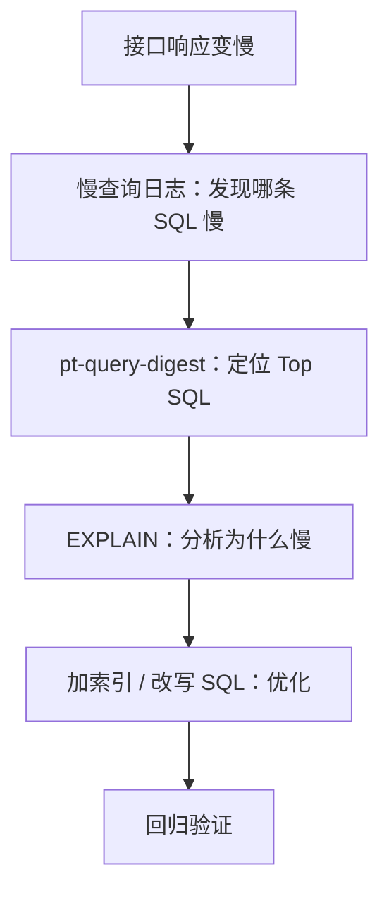

线上接口突然变慢，怀疑是 SQL 问题却不知道从哪查起？本文用 Docker 搭一套可复现环境，手把手带你走完「发现 → 定位 → 分析 → 优化」全流程。
<!-- more -->

# 前言：一个真实的场景

周四下午，你正在写需求，突然收到告警：订单查询接口的 P99 从 200ms 涨到了 8 秒。打开代码看了半天——逻辑很简单，就是按手机号查用户、再关联订单表，代码没有任何改动。你怀是数据库的问题，但打开 Navicat 连上生产库，又不知道从哪里查起：
```
    是哪条 SQL 慢？现在跑的 SQL 那么多。
    它为什么慢？是数据量大了，还是没走索引？
    该怎么修？加索引？改 SQL？加缓存？
```
这不是某一个人的困境。排查慢查询其实是一个有**标准流程**的工程问题，核心就四步：


本文的目标很实际：**读完之后，你能独立走完这四步，定位日常工作中** 90% 的**慢查询**问题。
为了让每个步骤都能动手验证，我会先在 Docker 里搭一套带 100 万行测试数据的环境，然后故意制造三条典型的慢 SQL——等值查询缺索引、LIKE 左模糊、多表 JOIN 缺索引——逐一带大家从发现、定位、分析到优化完整走一遍。文中所有命令和 SQL 均可直接复制复现。
`环境说明：MySQL 8.0.43（官方 Docker 镜像），客户端任意（本文用 docker exec 进入容器执行）。`
# 环境准备：5 分钟搭好实验环境
## 启动 MySQL 8.0.43
一条命令搞定：
```bash
docker run -d --name mysql8 -p 3306:3306 \
  -e MYSQL_ROOT_PASSWORD=root123 \
  -e MYSQL_DATABASE=mydb \
  -v mysql8-data:/var/lib/mysql \
  mysql:8.0.43
```
参数说明： 
|参数	|作用 |
|--------|--------|
|`--name mysql8`	|容器名，后面 `docker exec` 要用|
|`-p 3306:3306`	    |宿主机 3306 映射到容器 3306    |
|`MYSQL_ROOT_PASSWORD`|root 密码，生产环境务必改复杂   |
|`MYSQL_DATABASE=mydb`|	启动时自动创建实验数据库     |
|`-v mysql8-data`	    |  数据卷持久化，删容器数据不丢  |

启动后验证：
```bash
docker ps
docker logs mysql8
# 看到 ready for connections 即成功
```
## 建两张"故意没索引"的表
```sql
CREATE TABLE `user` (
  `id`         bigint      NOT NULL AUTO_INCREMENT,
  `name`       varchar(50) NOT NULL DEFAULT '',
  `phone`      varchar(20) NOT NULL DEFAULT '',
  `email`      varchar(100) NOT NULL DEFAULT '',
  `age`        int         NOT NULL DEFAULT 0,
  `city`       varchar(50) NOT NULL DEFAULT '',
  `created_at` datetime    NOT NULL DEFAULT CURRENT_TIMESTAMP,
  PRIMARY KEY (`id`)
) ENGINE=InnoDB DEFAULT CHARSET=utf8mb4;

CREATE TABLE `orders` (
  `id`         bigint       NOT NULL AUTO_INCREMENT,
  `user_id`    bigint       NOT NULL,
  `amount`     decimal(10,2) NOT NULL DEFAULT 0,
  `status`     tinyint      NOT NULL DEFAULT 0,   -- 0待支付 1已支付 2已发货
  `created_at` datetime     NOT NULL DEFAULT CURRENT_TIMESTAMP,
  PRIMARY KEY (`id`)
) ENGINE=InnoDB DEFAULT CHARSET=utf8mb4;
```
注意：**除了主键，一张业务索引都不加**。这不是失误，是故意留的"案发现场"——后面每一条慢 SQL，都是真实会发生的问题。

## 造数：两条 INSERT 生成 1500 万行
MySQL 8.0 支持递归 CTE，配合一张序列表做 CROSS JOIN，不用写存储过程循环：
```sql
-- ============================================
-- 0. 准备工作：调大递归深度（当前会话有效，避免 error 3636）
-- ============================================
SET SESSION cte_max_recursion_depth = 1000000;

-- ============================================
-- 1. 建序列表
-- ============================================
DROP TABLE IF EXISTS seq_0_999;
CREATE TABLE seq_0_999 (n INT PRIMARY KEY);
INSERT INTO seq_0_999 (n)
WITH RECURSIVE s AS (
    SELECT 0 AS n
    UNION ALL
    SELECT n + 1 FROM s WHERE n < 999
)
SELECT n FROM s;

-- ============================================
-- 2. 造 1000 万用户：1000 × 10000
-- ============================================
DROP TABLE IF EXISTS seq_0_9999;
CREATE TABLE seq_0_9999 (n INT PRIMARY KEY);
INSERT INTO seq_0_9999 (n)
WITH RECURSIVE s AS (
    SELECT 0 AS n
    UNION ALL
    SELECT n + 1 FROM s WHERE n < 9999
)
SELECT n FROM s;

INSERT INTO `user` (name, phone, email, age, city, created_at)
SELECT
    CONCAT('用户', a.n * 10000 + b.n),
    CONCAT('138', LPAD(FLOOR(RAND() * 100000000), 8, '0')),
    CONCAT('user', a.n * 10000 + b.n, '@test.com'),
    FLOOR(18 + RAND() * 60),
    ELT(FLOOR(1 + RAND() * 5), '北京', '上海', '广州', '深圳', '杭州'),
    DATE_ADD('2020-01-01', INTERVAL FLOOR(RAND() * 2000) DAY)
FROM seq_0_999 a
CROSS JOIN seq_0_9999 b;

-- ============================================
-- 3. 造 500 万订单：1000 × 5000
-- ============================================
DROP TABLE IF EXISTS seq_0_4999;
CREATE TABLE seq_0_4999 (n INT PRIMARY KEY);
INSERT INTO seq_0_4999 (n)
WITH RECURSIVE s AS (
    SELECT 0 AS n
    UNION ALL
    SELECT n + 1 FROM s WHERE n < 4999
)
SELECT n FROM s;

INSERT INTO orders (user_id, amount, status, created_at)
SELECT
    FLOOR(1 + RAND() * 10000000),
    ROUND(RAND() * 1000, 2),
    FLOOR(RAND() * 3),
    DATE_ADD('2024-01-01', INTERVAL FLOOR(RAND() * 365) DAY)
FROM seq_0_999 a
CROSS JOIN seq_0_4999 b;

-- ============================================
-- 4. 验证
-- ============================================
SELECT COUNT(*) FROM `user`;   -- 10000000
SELECT COUNT(*) FROM orders;   -- 5000000

-- 埋点：固定一条已知手机号，方便后面演示慢查询
UPDATE `user` SET phone = '13800001111' WHERE id = 1000100;
```

 
至此：我们创建了一个 100 万用户、50 万订单的实验环境。

# 慢查询日志
数据库本身就有"行车记录仪"：慢查询日志（Slow Query Log）。凡是执行时间超过阈值的 SQL，都会被原封不动地记录下来——执行了什么、花了多久、扫描了多少行、返回了多少行，一目了然。

我们的第一步，就是把它打开。
## 三个核心参数
慢查询日志由三个参数控制：

|参数	|作用	|默认值|
|--------|--------|--------|
|slow_query_log	|是否开启慢查询日志	|OFF（关闭）|
|long_query_time |超过多少秒算"慢"	|10 秒    |
|slow_query_log_file |	日志文件路径 |	数据目录下 <主机名>-slow.log|
|log_queries_not_using_indexes |	是否记录没走索引的 SQL（即使很快）|	OFF|


先看一眼当前配置：
```sql
SHOW VARIABLES LIKE 'slow_query_log';
SHOW VARIABLES LIKE 'long_query_time';
SHOW VARIABLES LIKE 'log_queries_not_using_indexes';
```
 

大概率你会看到 `slow_query_log = OFF`——也就是说，**默认情况下数据库对慢查询是"视而不见"的**。很多团队跑了几年数据库，这个开关从来没打开过，出了问题只能猜。
## 开启慢查询日志
临时开启（重启后失效，适合先验证）：
```sql
SET GLOBAL slow_query_log = ON;
SET GLOBAL long_query_time = 1;                  -- 阈值改成 1 秒
SET GLOBAL log_queries_not_using_indexes = ON;   -- 顺手记录未走索引的 SQL
```

再查一次确认生效。如果想持久化，把配置写进启动参数（Docker 场景改启动命令即可）：
```bash
docker run -d --name mysql8new -p 3306:3306 \
  -e MYSQL_ROOT_PASSWORD=root123 \
  -e MYSQL_DATABASE=mydb \
  -v mysql8-data:/var/lib/mysql \
  mysql:8.0.43 \
  --slow_query_log=ON \
  --long_query_time=1 \
  --log_queries_not_using_indexes=ON
```

顺便确认日志文件位置：
```sql
SHOW VARIABLES LIKE 'slow_query_log_file';
```
官方镜像默认在数据目录下，文件名类似 `1f643cd1ebdc-slow.log`。Docker 里查看日志内容：

```bash
docker exec mysql8new sh -c 'cat /var/lib/mysql/*-slow.log'
```
## 抓获第一条慢 SQL
万事俱备，现在去"犯罪现场"——执行一条看起来人畜无害的 SQL：
```sql
SELECT * FROM `user` WHERE phone = '13800001111';
```
这就是平时最常见的写法：根据手机号查用户。在 100 万行数据、且 phone 没有索引的表里，它会老老实实**全表扫描**。执行完毕后（大概要等两三秒），去看慢日志：
```bash
docker exec mysql8 sh -c 'cat /var/lib/mysql/*-slow.log'
```
你会看到类似这样的内容：
```plain
# Time: 2026-09-11T07:32:49.817895Z
# User@Host: root[root] @  [172.17.0.1]  Id:     8
# Query_time: 2.330087  Lock_time: 0.000008 Rows_sent: 1  Rows_examined: 10000000
SET timestamp=1789111967;
SELECT * FROM `user` WHERE phone = '13800001111';
```
逐字段解读这行"案发现场记录"：
``` 
· Query_time: 2.33 —— 这条 SQL 执行了 2.33 秒，超过我们设的 1 秒阈值，所以被记录
· Lock_time: 0.000008 —— 等锁时间几乎为 0，说明慢的锅不在锁竞争，而在查询本身
· Rows_examined: 10000000 —— 扫描了 1000 万行。这是全文最重要的一个数字
· Rows_sent: 1 —— 但最终只返回了 1 行
```
Rows_examined 和 Rows_sent 的对比，就是这条 SQL 的"判决书"：为了找到 1 条数据，把整张表翻了一遍。索引的意义，本质上就是把"扫描 1000 万行"变成"扫描几行"。
至此，第一关完成：我们不仅知道哪条 SQL 慢，还拿到了它的耗时和扫描行数这两个关键证据。
## 三个必踩的坑
坑 1：`long_query_time` 改了对已有连接不生效
```sql
SET GLOBAL long_query_time = 1;
```
这个改动**只影响之后新建立的连接**，你当前这个会话还在用旧值。如果你在同一个会话里改完立刻测试，会发现 2 秒的 SQL 根本没被记录——不是日志坏了，是阈值没生效。
验证方法：开个新连接再测，或者干脆改配置文件/启动参数，重启生效。
 

坑 2：`log_queries_not_using_indexes` 是双刃剑
它很有用（很多"暂时不慢"的无索引 SQL 是未来的定时炸弹），但在生产环境要小心：如果表里有大量高频的小查询没走索引，日志会迅速膨胀，甚至影响磁盘。
建议：排查期打开，平时关闭；或者把 `long_query_time` 调大一点配合使用。

坑 3：慢日志也在数据卷里
我们挂载了 mysql8-data 数据卷，所以删容器不会丢数据、也不会丢慢日志。但如果启动时没挂卷，容器一删，日志和数据一起蒸发。另外慢日志文件会持续增长，生产环境记得配 logrotate 或定期清理。
## 小结
到目前为止，我们掌握了排查的第一个标准动作：

```开慢日志 → 设阈值 → 复现慢 SQL → 从日志拿到 Query_time 和 Rows_examined。```

但慢日志只回答了"哪条 SQL 慢、有多慢"。它回答不了"为什么慢"——为什么扫描了 1000 万行？是优化器没选对索引，还是压根没有索引可用？
线上的慢日志往往一天几千条，逐条看也不现实。下一章我们请出日志分析工具，先把最值得修的那几条筛出来。