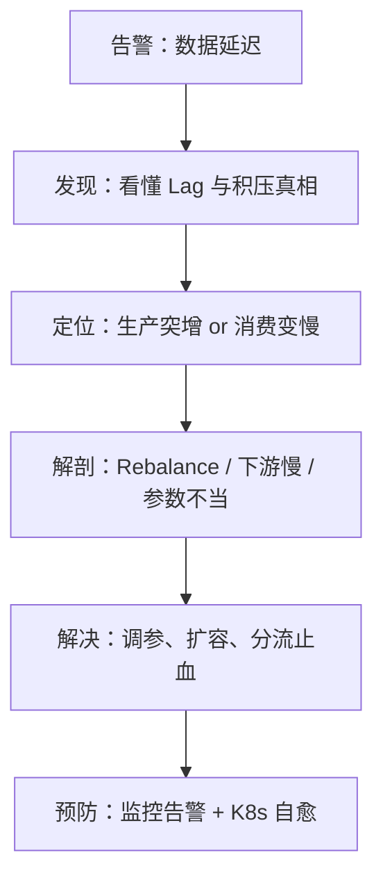

> Kafka 消费积压排查系列 · 第 3 篇。上一篇我们学会了三分钟分诊法：三个问题分清「生产突增」和「消费变慢」（没看过的建议先读：[《Lag 报警了先别重启：三分钟分清「生产突增」还是「消费变慢」》](https://nanoyeluo.github.io/2026/09/22/Lag-%E6%8A%A5%E8%AD%A6%E4%BA%86%E5%85%88%E5%88%AB%E9%87%8D%E5%90%AF%EF%BC%9A%E4%B8%89%E5%88%86%E9%92%9F%E5%88%86%E6%B8%85%E3%80%8C%E7%94%9F%E4%BA%A7%E7%AA%81%E5%A2%9E%E3%80%8D%E8%BF%98%E6%98%AF%E3%80%8C%E6%B6%88%E8%B4%B9%E5%8F%98%E6%85%A2%E3%80%8D/)）。分诊如果是"消费变慢、全分区均匀"，第一个要解剖的嫌疑人不在下游，而在消费组内部——这篇把 Rebalance 送上解剖台。
<!-- more -->

# 前言：最诡异的积压形态

还是那个订单同步服务。周五晚上九点，Lag 告警又响了。你现在已经很熟练了：生产速率 49 msg/s 平稳如常，消费速率却跌到接近零，12 个分区均匀积压——决策树指向"消费整体变慢"。

但接下来的检查让人摸不着头脑：消费者 Pod 的 CPU 空闲在 5%，下游 MySQL 的慢查询日志空空如也，应用日志连一条 ERROR 都没有。再看 Lag 曲线，呈诡异的**锯齿状**：涨一段、平一段、再涨一段。

```javascript
    消费者进程活着，为什么不干活？
    什么是 Rebalance？为什么它一来全组都停工？
    不看监控面板，怎么从日志确认 Rebalance 正在发生？
```

这是五步流程的第三步——**解剖**。分诊只给方向，定罪要靠解剖：



本文的目标很实际：**读完之后，你能说清 Rebalance 的机制与代价、亲手引爆一次 Rebalance 风暴、并用三行日志在线上确认它**。

`环境说明：沿用第 1 篇的实验环境（kafka 容器、order-event topic、consumer.py）和第 2 篇的两次采样脚本，命令规范同前两篇。`

# 解剖对象：Rebalance 到底是什么

先回收第 1 篇埋下的铁律：**一个分区，同一时刻只能被消费组内的一个消费者持有**。12 个分区 3 个消费者，就是每人 4 个，井水不犯河水。

问题来了：如果现在加进来第 4 个消费者，谁把分区让出来？让几个？这个"重新分地"的过程，就是 **Rebalance**——当消费组的成员或订阅关系发生变化时，分区所有权需要在成员之间重新分配。

然后是全篇最重要的一句话，请加粗记在脑子里：

**Rebalance 期间，整个消费组停工（stop-the-world）。**

默认协议下，所有成员先把手里的分区全部交出来，再由分配者重新发牌——交牌到发完牌之间，**没有任何人在消费**。积压的直接成因，就是这个"停工窗口"。偶尔一次 Rebalance 只停几秒，无伤大雅；但如果 Rebalance 反复发生、连绵不绝，消费组就陷入了"停工-复工-又停工"的死循环——这就是 **Rebalance 风暴**，前言里那条锯齿状 Lag 曲线的成因。

谁会触发 Rebalance？一张表说全：

| 触发源 | 典型场景 |
| --- | --- |
| 新成员加入 | 扩容消费者、K8s 滚动发布新 Pod 起来 |
| 成员主动离开 | 缩容、优雅停机 |
| 成员"死了" | 心跳超时（`session.timeout.ms`），如 Full GC 卡顿、网络中断 |
| 成员"卡死了" | 两次 poll 间隔超限（`max.poll.interval.ms`），消费逻辑处理太慢 |
| 订阅/分区变化 | topic 扩分区、订阅的 topic 列表变更 |

机制上还有两个角色，知道名字即可：broker 端的 **GroupCoordinator** 主持分配大局，消费者端的 **GroupLeader** 负责计算具体的分配方案。排障用不上它们的细节。

最后预告一个第 5 篇的伏笔：默认的分配协议叫 **eager**——"全量回收再分配"，就是上面说的全组停工；Kafka 2.4 引入了 **cooperative** 协议——"增量分配，只动该动的分区"，其他人照常消费。先记住这两个名字。

# 实验：亲手引爆一次 Rebalance 风暴

## 引爆原理

触发 Rebalance 最经典的生产事故，藏在 `max.poll.interval.ms` 这个参数里。它规定**两次拉取消息的最大间隔**（默认 5 分钟）——消费者一次拉一批消息回来处理，如果处理完这批再回来拉下一批的时间超过了这个上限，协调者就判定"这家伙卡死了"，把它踢出消费组，触发 Rebalance。

灾难剧本是这样的：`max.poll.records=500`（默认一次拉 500 条）× 每条处理 1 秒 = 一批要 500 秒 > 300 秒上限 → 被踢 → 触发 Rebalance → 它重新加入 → 又分到分区、又拉 500 条 → 又超时 → 又被踢……**循环往复，风暴成型**。

为了快速看到风暴，我们把参数调小一点。打开 `consumer.py`，改成这样：

```python
import logging
# kafka-python 的入组/回收日志是 INFO 级，不显式配置 logging 会全程静默
logging.basicConfig(level=logging.INFO,
                    format='%(asctime)s %(levelname)s %(name)s: %(message)s')

from kafka import KafkaConsumer
import time

consumer = KafkaConsumer(
    'order-event',
    bootstrap_servers='localhost:29092',
    group_id='order-consumer',
    auto_offset_reset='earliest',
    enable_auto_commit=True,
    max_poll_records=50,         # 每批拉 50 条
    max_poll_interval_ms=30000,  # 两批间隔上限 30 秒，本场风暴的"裁判"
    session_timeout_ms=60000,    # 保险项：避免网络抖动干扰实验节奏（非必需，原因见下文）
)

for msg in consumer:
    time.sleep(1)  # 每条处理 1 秒，一批 50 条要 50 秒 > 30 秒上限
```

Spring Kafka 对应的参数是 `max.poll.records` 和 `max.poll.interval.ms`（写在 consumer properties 里），效果完全一样。

这里有两个配置细节，少一个都可能"静观其变"半天却什么都看不到：

1. **必须先打开 logging**。kafka-python 的入组、回收分区这些日志都是 INFO 级，而 Python 默认只输出 WARNING 以上——不配 `logging.basicConfig`，风暴再猛烈，终端也一片寂静。"日志静默 ≠ 没发生"，这个系列反复强调的口诀，在实验环境里先应验了一次。
2. **心跳线程是标配，poll 超时才是"卡死"的裁判**。Java 客户端从 0.10.1 起就有独立的后台心跳线程（KIP-62）：消费逻辑处理得再慢，心跳也不会断，能判"卡死"的只有 `max.poll.interval.ms`。kafka-python 同样有心跳线程——等下真实日志里的 `kafka.coordinator.heartbeat` 模块名就是证据。所以 `session_timeout_ms` 调大到 60 秒只是保险（避免网络抖动干扰实验节奏），并非必需；真正主导这场风暴的，是 30 秒的 poll 超时。

另开一个终端，先灌点消息垫底——throughput 100、共 10 万条，够灌十几分钟，覆盖整个观察窗口：

```bash
docker exec kafka /opt/kafka/bin/kafka-producer-perf-test.sh \
  --topic order-event \
  --num-records 100000 \
  --record-size 1024 \
  --throughput 100 \
  --producer-props bootstrap.servers=localhost:9092
```

灌数的同时启动这个"带病"消费者，静观其变。

## 观察点 1：日志在循环滚动

启动后一两分钟内，日志开始循环滚动。下面是我们实验的真实输出（隐去分区清单细节），一个完整的循环长这样：

```plain
20:39:00 INFO  kafka.coordinator.consumer: Setting newly assigned partitions {order-event-0..11} for group order-consumer
20:39:30 WARN  kafka.coordinator.heartbeat: Consumer poll timeout has expired. This means the time between
               subsequent calls to poll() was longer than the configured max_poll_interval_ms, which typically
               implies that the poll loop is spending too much time processing messages. You can address this
               either by increasing max_poll_interval_ms or by reducing the maximum size of batches returned
               in poll() with max_poll_records.
20:39:30 INFO  kafka.coordinator: Leaving consumer group order-consumer (member kafka-python-3.0.11-098d16f2-...)
20:39:50 INFO  kafka.coordinator.consumer: Group order-consumer lost membership; forcibly revoking {order-event-0..11}
20:39:50 INFO  kafka.coordinator: (Re-)joining group order-consumer
20:39:50 INFO  kafka.coordinator: Successfully joined group order-consumer <Generation 19 (member_id: kafka-python-3.0.11-730a8504-...)>
20:39:50 INFO  kafka.coordinator: Elected group leader -- performing partition assignments using range
```

这段日志值得逐秒解剖，时间线上全是证据：

- **20:39:00**：分到 12 个分区，开始干活——一批 50 条 × 每条 1 秒，要 50 秒才能处理完；
- **20:39:30**：**正好 30 秒整**，心跳线程发现距上次 poll 超过了 `max_poll_interval_ms=30000`，判定"卡死"，主动离组——参数生效得一分不差。注意这条 WARNING 是 kafka-python 的贴心设计：它把修法直接写在日志里（调大 `max_poll_interval_ms` 或调小 `max_poll_records`），和后面「参数三角」一节的结论一字不差；
- **20:39:30 → 20:39:50 这 20 秒的空档**：踢人由心跳线程发起，但主线程还在闷头处理那批没处理完的消息，直到 50 秒处理完、回来 poll 时才发现"我已经被踢了"——于是强制回收分区（`forcibly revoking`）、重新入组；
- **Generation 19**：抓到这段日志时，循环已经转到了第 19 届。generation 是消费组"换届"的届数，线上看到它飙到几百上千，就是风暴的铁证；
- **member id 从 098d16f2 变成 730a8504**：每次重入组都换一个新身份——呼应观察点 2 里 CONSUMER-ID 的变化；
- 最后一行的 `range`：当前使用的分区分配策略，eager 协议下"全量回收再分配"的执行者。

然后，一切从头再来。
 
## 观察点 2：消费组状态在抽搐

另开一个终端，反复执行：

```bash
docker exec kafka /opt/kafka/bin/kafka-consumer-groups.sh \
  --bootstrap-server localhost:9092 \
  --describe --group order-consumer --state
```

下面是风暴期间的真实采样（连续快速执行了十几次），状态在两个值之间硬切换：

```plain
# 成员在岗时
GROUP           COORDINATOR (ID)   ASSIGNMENT-STRATEGY  STATE    #MEMBERS
order-consumer  kafka:9092 (1)     range                Stable   1

# 被踢后的空档：组里空无一人
Consumer group 'order-consumer' has no active members.

GROUP           COORDINATOR (ID)   ASSIGNMENT-STRATEGY  STATE    #MEMBERS
order-consumer  kafka:9092 (1)     -                    Empty    0
```



这里有个和直觉不符的点要说明：理论上 Rebalance 会经过 `PreparingRebalance` / `CompletingRebalance` 两个过渡态，但**单成员消费组的重分配是毫秒级完成的**，手工轮询根本抓不到——你只会看到 `Stable`（1 人）和 `Empty`（0 人）的硬切换。生产环境消费组有多个实例时，过渡态要等所有成员到齐才结束，能持续数秒，那时才能抓到它。

实际采样还有一层解读技巧：风暴的一个周期里约 30 秒在岗（Stable）、20 秒空档（Empty）。如果连续多次采样都是 Empty，先别急着下结论——连着快速执行时，一组 Empty 样本可能只是**同一次空档的密集采样**；间隔很久采还是 Empty，才说明消费者进程真的不在了（主动 Ctrl+C 离组，组也会变 Empty）。

另外两个细节值得记住：

- `ASSIGNMENT-STRATEGY` 列：有成员时显示 `range`（当前分配策略），Empty 时是 `-`；
- **Empty ≠ 没有积压**——位点还在，Lag 还在涨，只是没有在线成员在消费。这就是第 1 篇坑 1、第 2 篇决策矩阵首行"消费者不在线"的实景。把 `--state` 去掉再执行一次 `--describe`，你会看到 CONSUMER-ID 列变成了 `-`；而在 Stable 的窗口期里看，CONSUMER-ID 里的 UUID 每循环一次就变一次——每次重入组，成员都换一个新身份（对照观察点 1 日志里的 member id 换血）。
 
## 观察点 3：consume rate 恒为零——比锯齿更狠的真相

跑第 2 篇的两次采样脚本。多跑几次，你会发现一个"坏消息"：consume rate 永远是 0：

```plain
produce rate: 107 msg/s
consume rate: 0 msg/s
backlog rate: +107 msg/s  # >0 = still piling up

# 隔几分钟再跑，一模一样
produce rate: 107 msg/s
consume rate: 0 msg/s
backlog rate: +107 msg/s
```



不是运气差采不到"复工"的瞬间——**这套风暴配置下，消费位点永远提交不上**。回忆一下机制：`enable_auto_commit` 的提交动作搭 poll 的便车，处理一批消息的 50 秒里没有任何 poll，自然没有任何提交；而每次 poll 到达的那一刻，消费者恰恰刚被踢出组——提交要么直接失败（generation 已过期），要么提交的是重入组后被重置回去的旧位点。于是每一批 50 条都是白干：处理完 → 被踢 → 位点作废 → 重入组 → 再拉**同样的** 50 条。**Lag 匀速直线上涨，消费者空转到天荒地老**——这就是"看起来很忙却不干活"的极端形态。

那前言里说的"锯齿状"哪来的？锯齿需要**部分批次能提交成功**：线上更常见的是间歇性风暴——偶发的 Full GC、偶发的慢查询让处理时长在超时线上下波动，超时的批次位点作废（Lag 涨一截），没超时的批次提交成功（Lag 追一小段），一涨一追就是锯齿。

**第二次校准：改成随机休眠，为什么还是恒为 0？**

直觉方案是把 `time.sleep(1)` 换成 `time.sleep(random.uniform(0.4, 0.8))`，让批次耗时在 20~40 秒之间围着 30 秒红线波动。但真跑起来，consume rate 依然是 0。三个原因叠在一起：

1. **数学上，一半批次照样被判死刑**。0.4~0.8 均匀分布的均值是 0.6，×50 条 = 批耗时均值正好 30 秒，压在红线上；而且 50 个随机数相加方差极小（±1 秒级），约一半批次仍超时——风暴只是从"100% 死刑"变成"50% 死刑"，没有消失；
2. **活下来的批次吞吐太弱**。一半成功（+50 条）、一半被踢重来（+0，还搭上重入组的十几秒），折算下来 ≈ 0.6 条/秒；
3. **采样脚本的分辨率看不见 0.6 条/秒**。30 秒窗口只积累十几条，而 test.sh 的 `$(( (c2-c1)/30 ))` 是整数除法，18/30 = 0。**不是消费停了，是监控分辨率把濒死的消费四舍五入成了零**——线上同理：采样窗口和聚合粒度，决定了你能不能看见"慢但还活着"的消费者。

多跑几次，还会撞见分辨率露馅的瞬间——consume rate 在 0 和 1 之间跳：

```plain
produce rate: 107 msg/s
consume rate: 0 msg/s
backlog rate: 107 msg/s  # >0 = still piling up

# 隔一会儿再跑
produce rate: 107 msg/s
consume rate: 1 msg/s
backlog rate: 105 msg/s  # >0 = still piling up

ac29e28e725f:/tmp$ sh test.sh
produce rate: 107 msg/s
consume rate: 3 msg/s
backlog rate: 104 msg/s  # >0 = still piling up

```


这个 1 不是"消费变好了"，而是**恰好有一个批次在这 30 秒窗口内活着提交成功**（一批 ≈50 条，整数除法后显示 1）；其他窗口里提交落在边界外，就是 0。同一个小数吞吐，在粗粒度监控下跳成"时好时坏"的假象——线上很多"消费组忽好忽坏"的误判，根源就在这里。注意 backlog rate 也是自洽的：107 − 1 ≈ 105。

验证它没死很简单：别看速率，直接看位点差（把 echo 改成 `$((c2-c1))` 原始值），或者把窗口拉到 120 秒——你会看到位点在爬，只是慢。

要真正看到锯齿，还差最后一个条件：**消费速度得能短暂追上生产速度**。生产者以 100 条/s 灌着，消费哪怕活过来也只有 ~1 条/s，Lag 永远单边上涨，锯不起来。所以锯齿实验的正确姿势是：**生产者停掉（或 throughput 调到个位数）+ 毒消息版休眠**：

```python
import random
# 98% 正常消息 0.3 秒，2% 毒消息 10 秒——偶发慢处理把批次拖过红线
time.sleep(0.3 if random.random() > 0.02 else 10)
```

这个配置下，大部分批次十几到二十几秒安全提交（Lag 掉一截），偶尔凑够两条毒消息越过红线被踢（Lag 反弹）——锯齿出现。而且"偶发毒消息"比均匀随机更像真实的下游抖动，它同时预告了第 4 篇的主角：一条慢 SQL，就是那批毒消息。



## 风暴的隐藏代价：重复消费

风暴还有个更阴的副作用。消费者被踢出组时，**已处理但还没来得及提交的位点全部作废**，重新入组后从上次的提交位点重读。假设一批 50 条处理了 40 条就被踢——这 40 条全部重来一遍。

观察点 3 已经见过实锤：consume rate 恒为 0 的那段时间里，消费者一直在忙——忙的就是重复消费，每一批 50 条都在白干。

也就是说，风暴期间你的下游（MySQL、ES）在被**反复写入同样的数据**。这就是为什么 at-least-once 语义下，下游必须幂等——重复消费不是异常，是协议的固有行为。记住这一点，坑 2 还会回来算账。

# 日志识别：三行日志确认 Rebalance

实验环境里风暴一目了然，线上可没这么直观。核心技能是：**从日志里快速确认 Rebalance 正在发生**。直接 grep 这几个关键词（以 Spring Kafka / Java 客户端为准，其他客户端措辞略有差异）：

| 日志关键词 | 含义 |
| --- | --- |
| `Revoking previously assigned partitions` | 分区被回收，Rebalance 开始 |
| `(Re)joining group` | 消费者正在（重新）入组 |
| `Successfully joined group` / `Assignment received` | 分配完成，恢复消费 |
| `Commit cannot be completed since the consumer has already rejoined the group` | 提交失败——重复消费正在发生 |

其他客户端措辞不同但角色一一对应，以本次实验的 kafka-python 为例：`forcibly revoking` ≈ Revoking（回收）、`(Re-)joining group` 两边一致、`Setting newly assigned partitions` ≈ Assignment received（分配完成）。kafka-python 还有一条 Java 没有的贴心 WARNING——`Consumer poll timeout has expired`，它会把修法（调大 poll 间隔或调小批次）直接写在日志里。

重点在**频率**：偶尔一次 Rebalance 是正常运维事件（扩缩容、发版都会触发），不用紧张；分钟级反复出现才是风暴。一条命令统计频率：

```bash
grep -c "Revoking previously assigned partitions" app.log
# 再结合日志时间范围算一算：每小时几次是正常，每分钟几次是风暴
```

有监控体系的话，还可以直接看客户端指标 `consumer-coordinator-metrics` 里的 `rebalance-rate-per-hour`——怎么把这个指标接进告警，第 6 篇展开。

# 参数三角：timeout 三兄弟

风暴的引信是参数，灭火的钥匙也是参数。三个 timeout 各管一摊，**方向调反了越修越糟**：

| 参数 | 默认值 | 管什么 | 判定什么"死" |
| --- | --- | --- | --- |
| `session.timeout.ms` | 45s | 心跳超时上限 | 消费者进程死了（GC 卡顿、网络断） |
| `heartbeat.interval.ms` | 3s | 心跳间隔 | 必须远小于 session.timeout |
| `max.poll.interval.ms` | 5min | 两次 poll 的最大间隔 | 消费逻辑卡死了（处理太慢） |

一句话记忆：**session 管"死活"，poll 管"卡死"**。进程还在但处理慢，是 poll 的事；进程心跳都没了，是 session 的事。

调整规则也就清楚了：

- **处理慢**（我们实验里的剧本）→ 调大 `max.poll.interval.ms`，或者减小 `max.poll.records`——每批少拉点，处理完再来。治本永远是让处理变快，调参只是给处理争取时间；
- **网络抖动 / GC 卡顿** → 调大 `session.timeout.ms`，别一卡就判死刑。

注意一个反直觉的代价：`max.poll.interval.ms` 调太大，风暴是止住了，但消费者**真卡死**的时候，也要等同样长的时间才被发现——参数把故障掩盖了，而不是修复了。坑 1 详谈。

# K8s 场景：滚动发布与静态成员

如果你的消费服务跑在 K8s 里，有一个场景天然高发 Rebalance：**滚动发布**。

算一笔账：10 个实例的消费组发一次版，滚动策略逐个重建 Pod——每杀掉一个旧 Pod（成员离开）触发一次 Rebalance，每拉起一个新 Pod（成员加入）又触发一次。10 个实例发一次版 ≈ **20 次全组停工**。发布期间消费几乎停滞，发布后 Lag 已经积了一座小山。

三件套把伤害降到最低：

1. **优雅退出**：`terminationGracePeriodSeconds` 给足（至少覆盖一次 Rebalance 时间），preStop 钩子里等待，消费者在 shutdown hook 里主动 `close()` 离组——主动告别比"心跳超时被发现"快得多，停工窗口从 45 秒缩到秒级；
2. **静态成员 `group.instance.id`**：给每个实例一个固定身份。Pod 重建后带着同一个身份回来，协调者认出"是熟人回来了"，在 session 超时内归队不触发重分配——K8s 消费组的标配；
3. **配合 cooperative 协议**：增量分配，只回收需要易手的分区，其他分区照常消费。和静态成员是黄金搭档，完整配置第 5 篇给。

最后回收第 2 篇坑 1 的伏笔，现在可以拼出完整的事故链了：**消费变慢 → 探针判定不健康 → 杀 Pod → 新 Pod 入组触发 Rebalance → 全组停工更慢 → 更多 Pod 被判不健康**——"重启让积压雪上加霜"的完整链条，每一环都是机制，没有一环是玄学。

# 三个必踩的坑

## 坑 1：把 max.poll.interval.ms 当万能药调大

出了风暴，很多人的第一反应是把 `max.poll.interval.ms` 从 5 分钟调到 30 分钟。风暴确实止住了——但代价是：消费者**真卡死**的时候，也要 30 分钟才被发现。参数没有修复故障，只是把故障的发现时间推迟了。正确的顺序永远是：**先查为什么慢（第 4 篇的主场），再决定调不调参**。

## 坑 2：忽视风暴期的重复消费

实验里我们已经看到：被踢出组时未提交的位点作废，消息整批重读。如果下游是"insert 一条订单记录"这种非幂等操作，风暴过后数据库里就是一片重复数据。at-least-once 语义下，**重复消费不是 bug，是特性**——下游写库写 ES 必须幂等（唯一键、去重表、业务主键 upsert），这是消费端代码的及格线。

## 坑 3：消费者比分区多

Lag 压不住了，扩容！12 个分区的 topic，消费者从 3 个扩到 20 个——然后发现 Lag 纹丝不动。回收第 1 篇的铁律：一个分区只能被一个消费者持有，12 个分区最多喂饱 12 个消费者，**多出来的 8 个永远空闲**，白占资源不提速。分区数是消费并发的硬上限——这就是为什么第 1 篇建 topic 时我们特意强调分区数，第 5 篇会把它展开成完整的扩容方法论。

## 小结

到目前为止，我们解剖完了"消费变慢"的第一个嫌疑人：

```javascript
Rebalance = 全组停工重分配；风暴 = 踢出 → 重入 → 再踢出的死循环
识别：Revoking / (Re)joining / Commit cannot be completed 三行日志，看频率
参数：session 管死活，poll 管卡死，方向别调反
代价：停工窗口积压 + 未提交位点作废的重复消费
```

但如果你的现场是这样的：日志干净、Rebalance 频率正常、参数也没动过——消费还是慢。那凶手就不在消费组内部，而在消费者**之外**：它调用的下游依赖。下一篇《一条慢 SQL 拖垮整个消费组：下游依赖的连锁反应解剖》，我们去消费链路的末端揪出真凶。